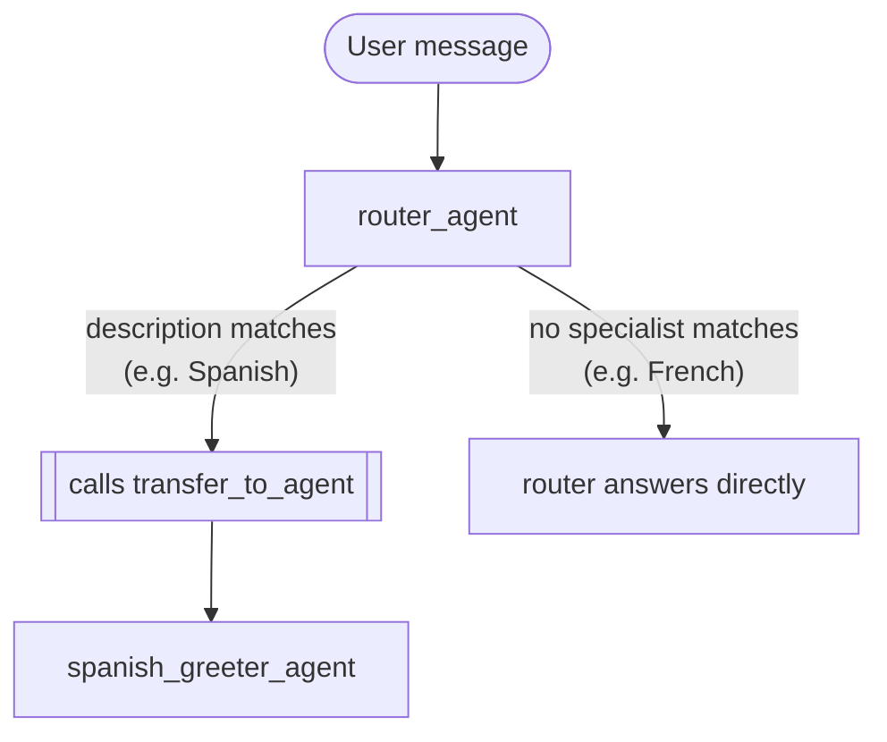

# Módulo 15: Introducción a Sistemas Multi-Agente (Go) 🤝

## Teoría

### Más Allá de un Solo Agente 🌱

Cada agente hasta ahora ha sido un `llmagent` haciendo un solo trabajo. Eso funciona genial para una tarea enfocada, pero un sistema que maneja varios dominios distintos — facturación, soporte técnico, ventas — empieza a forzar rápido la instrucción y la lista de herramientas de un solo agente. Dividir el problema en un equipo de agentes especialistas, cada uno con un trabajo estrecho y bien definido, mantiene a cada uno simple de escribir, probar y cambiar de forma independiente. ¡Divide y vencerás! 💪

### Registro: `SubAgents`

`llmagent.Config.SubAgents []agent.Agent` es cómo un agente registra a otros agentes como su equipo — ya usado de verdad en el módulo 13, donde `finance_agent` registra a un `supervisor`:

```go
return llmagent.New(llmagent.Config{
    Name:        "finance_agent",
    Model:       llmModel,
    Description: "Helps users with their investments, requiring human approval for every trade.",
    Instruction: financeInstruction,
    Tools:       []tool.Tool{investmentTool},
    SubAgents:   []agent.Agent{supervisorAgent},
})
```

El router que diseña este módulo (Laboratorio 15) usa el mismo campo, solo que sin herramientas propias — `SubAgents: []agent.Agent{spanishGreeter}` — ya que su único trabajo es delegar.

Registrar un sub-agente hace una sola cosa concreta: convierte a ese agente en un destino real de transferencia. Confirmado leyendo el propio código fuente del SDK (`internal/llminternal/agent_transfer.go`): cuando un agente tiene `SubAgents` no vacío, el framework agrega automáticamente una herramienta `transfer_to_agent` a la solicitud de ese agente, junto con instrucciones construidas a partir del `Description` de cada sub-agente — la lista exacta sobre la que el propio LLM del router razona para decidir cuál especialista es el correcto para una solicitud dada. 🧠

### Ejecución: El Modelo Llama a `transfer_to_agent` Él Mismo 🎬

La delegación no es un paso de enrutamiento separado que tú escribes — es el modelo mismo decidiendo, en plena conversación, llamar a una herramienta que el framework puso ahí justo para esto. Confirmado en vivo en el módulo 13: cuando una herramienta plana (sin puerta de confirmación) pone `ctx.Actions().TransferToAgent`, el framework cambia el agente activo en ese mismo turno, antes de que el modelo tenga otra oportunidad de hablar — y la herramienta `transfer_to_agent` inyectada automáticamente hace exactamente eso por dentro (su propio método `Run` es una función de dos líneas: lee `agent_name` de los argumentos de la llamada, pone `ctx.Actions().TransferToAgent`). Así que la secuencia completa para un router sin herramientas propias — solo `SubAgents` — es:

1. El mensaje del usuario llega al router.
2. El LLM del router ve su propia instrucción, el mensaje del usuario, y la lista auto-generada de nombres y descripciones de especialistas.
3. Si la descripción de un especialista calza, el modelo llama a `transfer_to_agent(agent_name: "...")` — nada más, según las instrucciones auto-inyectadas.
4. El framework cambia el agente activo de inmediato, en el mismo turno.
5. La instrucción propia del especialista (y sus herramientas, si tiene) toman el control desde ahí.

Si ningún especialista calza, el modelo simplemente no llama a la herramienta — responde directo, usando lo que su propia instrucción diga para ese caso.

Ambas ramas de esa decisión, calzando con el diseño que construye el laboratorio de este módulo:



### No Se Necesita Ningún Wrapper `workflow` — Y Eso Es Buena Noticia 🎉

`google.golang.org/adk/v2/workflow` y `agent/workflowagent` son paquetes reales y separados (`workflow.NewFunctionNode`, `workflowagent.New(workflowagent.Config{...})`) construidos para un estilo de colaboración distinto: enrutamiento determinista y dirigido por código entre nodos, en vez de que el modelo decida. Simplemente no hacen falta para el patrón que cubre este módulo — confirmado en vivo en el módulo 13, un `llmagent` plano con `SubAgents` se basta a sí mismo para delegación dirigida por LLM. Los módulos posteriores sobre orquestación estática y cíclica de workflows son donde `workflow`/`workflowagent` realmente se ganan su lugar.

### Puntos Clave ✅
- `SubAgents` registra a un especialista como un destino real de transferencia — el framework agrega automáticamente una herramienta `transfer_to_agent` una vez que se define, construida a partir del `Description` propio de cada especialista.
- La delegación es decisión propia del modelo, tomada llamando a esa herramienta auto-inyectada — no una función de enrutamiento que tú escribes.
- Una transferencia sin puerta de confirmación cambia el agente activo de inmediato, en el mismo turno — confirmado en vivo en el módulo 13.
- `workflow`/`workflowagent` son el camino real de Go para enrutamiento de nodos determinista y dirigido por código — un patrón distinto de la delegación dirigida por LLM que cubre este módulo.

<hr/>

> **¿Vienes de Python?** 🐍 `Workflow(edges=[("START", router)])` de Python cumple la misma división de registro/ejecución que describe este módulo, pero incluso el propio material de Python nota que el contenedor `Workflow` no es necesario para delegación dirigida por LLM — un `Agent` plano con `sub_agents` también basta ahí, calzando exactamente con `SubAgents` de Go.
