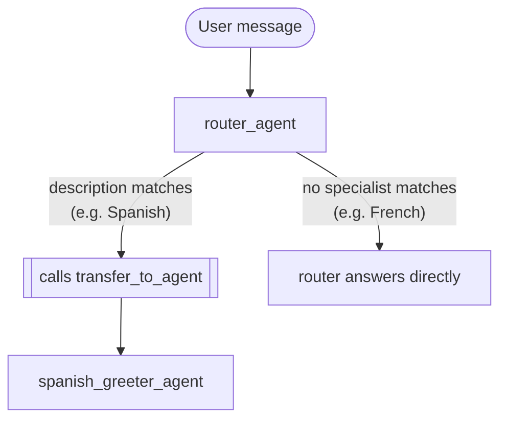

# Module 15: Introduction to Multi-Agent Systems (Go) 🤝

## Theory

### Beyond a Single Agent 🌱

Every agent so far has been one `llmagent` doing one job. That works great for a focused task, but a system juggling several distinct domains — billing, technical support, sales — starts straining a single agent's instruction and tool list pretty fast. Splitting the problem into a team of specialist agents, each with a narrow, well-defined job, keeps each one simple to write, test, and change independently. Divide and conquer! 💪

### Registration: `SubAgents`

`llmagent.Config.SubAgents []agent.Agent` is how one agent registers other agents as its team — already used for real back in module-13, where `finance_agent` registers a `supervisor`:

```go
return llmagent.New(llmagent.Config{
    Name:        "finance_agent",
    Model:       llmModel,
    Description: "Helps users with their investments, requiring human approval for every trade.",
    Instruction: financeInstruction,
    Tools:       []tool.Tool{investmentTool},
    SubAgents:   []agent.Agent{supervisorAgent},
})
```

The router this module designs (Lab 15) uses the same field, just with no tools of its own — `SubAgents: []agent.Agent{spanishGreeter}` — since its only job is delegation.

Registering a sub-agent does one concrete thing: it makes that agent a real transfer target. Confirmed by reading the SDK's own source (`internal/llminternal/agent_transfer.go`): whenever an agent has a non-empty `SubAgents`, the framework automatically appends a `transfer_to_agent` tool to that agent's own request, along with instructions built from each sub-agent's `Description` — the exact list the router's own LLM reasons over to figure out who's the right specialist for a given request. 🧠

### Execution: The Model Calls `transfer_to_agent` Itself 🎬

Delegation isn't a separate routing step you write — it's the model itself deciding, mid-conversation, to call a tool the framework put there for exactly this purpose. Confirmed live in module-13: when a plain (non-confirmation-gated) tool sets `ctx.Actions().TransferToAgent`, the framework switches the active agent on the very same turn, before the model gets another chance to speak — and the auto-injected `transfer_to_agent` tool does exactly that internally (its own `Run` method is a two-line function: read `agent_name` from the call's arguments, set `ctx.Actions().TransferToAgent`). So here's the full sequence for a router with no tools of its own — just `SubAgents`:

1. The user's message reaches the router.
2. The router's LLM sees its own instruction, the user's message, and the auto-generated list of specialist names + descriptions.
3. If a specialist's description matches, the model calls `transfer_to_agent(agent_name: "...")` — nothing else, per the auto-injected instructions.
4. The framework switches the active agent immediately, same turn.
5. The specialist's own instruction and (if any) tools take over from there.

If no specialist matches, the model simply doesn't call the tool — it just answers directly, using whatever its own instruction says to do in that case.

Both branches of that decision, matching the design this module's lab builds:



### No `workflow` Wrapper Required — And That's Great News 🎉

`google.golang.org/adk/v2/workflow` and `agent/workflowagent` are real, separate packages (`workflow.NewFunctionNode`, `workflowagent.New(workflowagent.Config{...})`) built for a different collaboration style: deterministic, code-driven routing between nodes, rather than the model deciding. They're just not needed for the pattern this module covers — confirmed live in module-13, a plain `llmagent` with `SubAgents` handles this all on its own for LLM-driven delegation. Later modules on static and cyclic workflow orchestration are where `workflow`/`workflowagent` really earn their keep.

### Key Takeaways ✅
- `SubAgents` registers a specialist as a real transfer target — the framework auto-injects a `transfer_to_agent` tool once it's set, built from each specialist's own `Description`.
- Delegation is the model's own decision, made by calling that auto-injected tool — not a routing function you write.
- A non-confirmation-gated transfer switches the active agent immediately, same turn — confirmed live in module-13.
- `workflow`/`workflowagent` are the real Go path for deterministic, code-driven node routing — a different pattern than the LLM-driven delegation this module covers.

<hr/>

> **Coming from Python?** 🐍 Python's `Workflow(edges=[("START", router)])` plays the same registration/execution split this module describes, but even Python's own material notes the `Workflow` container isn't required for LLM-driven delegation — a plain `Agent` with `sub_agents` is enough there too, matching Go's `SubAgents` exactly.
