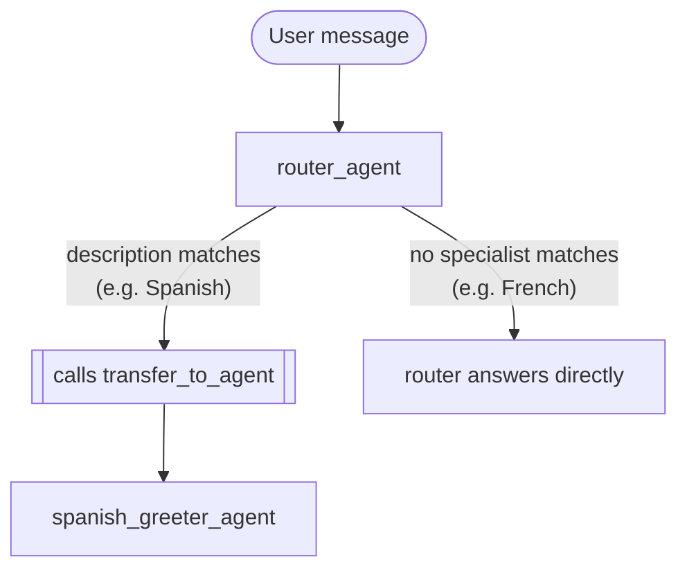

# Laboratorio 15: Diseñando un Sistema Multi-Agente (Go) 📝

## Objetivo

Antes de escribir código, diseñemos en papel un sistema simple de dos agentes. Este laboratorio es puramente un ejercicio de diseño — construirás la versión real en el próximo módulo.

Nuestro sistema: un "Router de Saludos" — un agente router y un especialista que sabe saludar en español.

### El Escenario

Un agente monolítico que maneje saludos en todos los idiomas necesitaría una instrucción inmanejablemente compleja. En vez de eso, diseñaremos un router más un especialista por idioma — para este laboratorio, solo el router y un especialista en español.

---

### Paso 1: Define los Roles y Responsabilidades 🎭

#### Agente 1: El Router

- **Propósito:** El agente padre. Su único trabajo es entender la solicitud y delegar al especialista correcto — nunca saluda a nadie él mismo.
- **Construcción en Go:** `llmagent.New(llmagent.Config{...})`, con `SubAgents: []agent.Agent{spanishGreeter}`.
- **Idea inicial de instrucción:**
  ```
  You are a language router. Your job is to understand which language the user
  wants to be greeted in and delegate to the appropriate specialist.
  If the user asks for a greeting in Spanish, delegate to the specialist for
  Spanish.
  ```
- **Herramientas:** Ninguna propia — su única "herramienta" real es la función `transfer_to_agent` que el framework inyecta automáticamente porque tiene `SubAgents` definido.

#### Agente 2: El Saludador en Español

- **Propósito:** El especialista. Su único trabajo es saludar cálidamente al usuario en español.
- **Construcción en Go:** un `llmagent.New(llmagent.Config{...})` plano, sin `SubAgents`, sin herramientas — la misma forma sin herramientas que `persistentagent` del módulo 13.5.
- **Descripción (para el router):** esto es lo que el propio LLM del router lee para decidir si este especialista calza con una solicitud — escríbela tú mismo ahora, lo suficientemente específica y orientada a la acción para distinguirla claramente de un futuro `french_greeter_agent`. Anótala; la reusarás en el Paso 2 y en el código real del módulo 16.
- **Idea inicial de instrucción:**
  ```
  You are a friendly assistant who only speaks Spanish. Greet the user warmly
  in Spanish. Do not say anything else.
  ```

---

### Paso 2: Mapea el Flujo de Interacción 🗺️



#### Flujo 1: Idioma Soportado (Español) ✅

1. **Entrada del usuario:** "¿Puedes saludarme en español?" llega al router vía `runner.Run`.
2. **El router razona:** el framework ya agregó una herramienta `transfer_to_agent` a la solicitud del router, con instrucciones construidas a partir del propio `Description` del saludador en español (confirmado en el módulo 13: `AgentTransferRequestProcessor` de `internal/llminternal/agent_transfer.go` hace esto automáticamente, ya que el router tiene `SubAgents` definido).
3. **El router delega:** el modelo llama a `transfer_to_agent(agent_name: "spanish_greeter_agent")` — la única acción hacia la que apuntan su instrucción y la descripción del especialista.
4. **El framework transfiere el control:** confirmado en vivo en el módulo 13, esto cambia el agente activo de inmediato, en el mismo turno — sin ida y vuelta extra.
5. **El especialista se ejecuta:** la propia instrucción del saludador en español toma el control.
6. **El especialista responde:** algo como `"¡Hola, mucho gusto!"`.

#### Flujo 2: Idioma No Soportado ❌

1. **Entrada del usuario:** "¿Puedes saludarme en francés?"
2. **El router razona:** no ve ningún especialista registrado cuya descripción calce con "francés."
3. **El router responde directo:** nunca llama a `transfer_to_agent` — según su propia instrucción para el caso sin coincidencia, simplemente responde con su propia voz: `"Lo siento, todavía no tengo un especialista para ese idioma."`

---

### Paso 3: Planifica la Estructura de Archivos 🏗️

Siguiendo la propia convención de este repo (confirmada contra `financeagent`, que construye tanto `finance_agent` como su sub-agente `supervisor` en un solo archivo, reservando un segundo archivo solo para lógica de manejo de herramientas — la misma forma que usan `calculator` y `factfinder` también):

```
adk-training-go/
├── internal/agents/greetingsystem/
│   ├── agent.go              <-- BuildRootAgent: builds the Spanish greeter,
│   │                             then the router, registering SubAgents
│   └── prompts/
│       ├── router_instruction.md
│       └── spanish_greeter_instruction.md
└── cmd/greeting-system/
    └── main.go                <-- standard launcher wiring
```

`agent.go` necesita:
1. Construir el agente saludador en español.
2. Construir el router con `SubAgents: []agent.Agent{spanishGreeter}}`.

Ambos en el mismo archivo — este sistema no tiene lógica propia de manejo de herramientas (la única herramienta del router es el `transfer_to_agent` auto-inyectado por el framework), así que tampoco hay un `tools.go` que separar, a diferencia de `calculator`/`financeagent`.

No se planea ningún archivo `Workflow`/`workflowagent` — el módulo 13 ya confirmó que un `llmagent` plano con `SubAgents` es suficiente para este patrón.

### Resumen del Laboratorio 🎉

Diseñaste en papel un sistema de dos agentes: los roles de especialista y router, la descripción que impulsa la delegación, ambos flujos de interacción, y la estructura de archivos Go que el próximo módulo construirá de verdad. ¡Muy bien hecho!

### Preguntas de Autorreflexión 🤔
- ¿Cuál es la pieza de información más importante que le permite al router decidir a qué especialista delegar?
- ¿Cómo extenderías este diseño para soportar francés? ¿Qué archivos o registros nuevos necesitarías?
- Este diseño usa delegación dirigida por LLM (el modelo llamando a `transfer_to_agent` él mismo). ¿Qué cambiaría si el router en cambio llamara al saludador en español como una función y recibiera un resultado, en vez de ceder el control permanentemente? (Todavía no construiste ese patrón — un módulo posterior sobre `AgentTool` lo cubre. Por ahora, solo piensa en la diferencia entre una transferencia de una sola vía y una llamada-con-retorno.)

<hr/>

> **¿Vienes de Python?** 🐍 El laboratorio de Python planea `agent.py` (el router + `Workflow`) y `spanish_greeter_agent.py` (el especialista) como dos módulos Python separados. Este plan en cambio construye ambos agentes en un solo archivo Go, calzando con cómo `financeagent` ya construye su propio par router-y-especialista — y se salta por completo el wrapper `Workflow`, ya que el propio material de Python ya nota que tampoco es necesario ahí.
