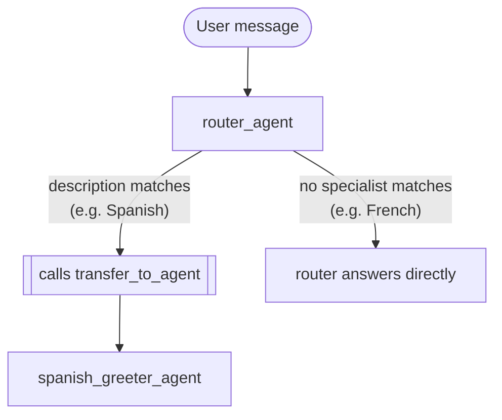

# Lab 15: Designing a Multi-Agent System (Go)

## Goal

Before writing any code, design a simple two-agent system on paper. This lab is entirely a design exercise — you'll implement it for real in the next module.

Our system is a "Greeting Router": a router agent and one specialist that knows how to greet in Spanish.

### The Scenario

A monolithic agent handling greetings in every language would need an unmanageably complex instruction. Instead, we'll design a router plus one specialist per language — for this lab, just the router and a Spanish specialist.

---

### Step 1: Define the Roles and Responsibilities

#### Agent 1: The Router

- **Purpose:** The parent agent. Its only job is to understand the request and delegate to the right specialist — it never greets anyone itself.
- **Go construct:** `llmagent.New(llmagent.Config{...})`, with `SubAgents: []agent.Agent{spanishGreeter}`.
- **Initial instruction idea:**
  ```
  You are a language router. Your job is to understand which language the user
  wants to be greeted in and delegate to the appropriate specialist.
  If the user asks for a greeting in Spanish, delegate to the specialist for
  Spanish.
  ```
- **Tools:** None of its own — its only real "tool" is the `transfer_to_agent` function the framework auto-injects because it has `SubAgents` set.

#### Agent 2: The Spanish Greeter

- **Purpose:** The specialist. Its only job is to greet the user warmly in Spanish.
- **Go construct:** a plain `llmagent.New(llmagent.Config{...})`, no `SubAgents`, no tools — the same tool-free shape as module-13_5's `persistentagent`.
- **Description (for the router):** this is what the router's own LLM reads to decide whether this specialist matches a request — write it yourself now, specific and action-oriented enough to clearly distinguish it from a future `french_greeter_agent`. Jot it down; you'll reuse it in Step 2 and in module-16's real code.
- **Initial instruction idea:**
  ```
  You are a friendly assistant who only speaks Spanish. Greet the user warmly
  in Spanish. Do not say anything else.
  ```

---

### Step 2: Map the Interaction Flow



#### Flow 1: Supported Language (Spanish)

1. **User input:** "Can you greet me in Spanish?" reaches the router via `runner.Run`.
2. **Router reasons:** the framework has already appended a `transfer_to_agent` tool to the router's request, with instructions built from the Spanish greeter's own `Description` (confirmed in module-13: `internal/llminternal/agent_transfer.go`'s `AgentTransferRequestProcessor` does this automatically, since the router has `SubAgents` set).
3. **Router delegates:** the model calls `transfer_to_agent(agent_name: "spanish_greeter_agent")` — the only action its instruction and the specialist's description point it toward.
4. **Framework transfers control:** confirmed live in module-13, this switches the active agent immediately, on the same turn — no extra round trip.
5. **Specialist executes:** the Spanish greeter's own instruction takes over.
6. **Specialist responds:** something like `"¡Hola, mucho gusto!"`.

#### Flow 2: Unsupported Language

1. **User input:** "Can you greet me in French?"
2. **Router reasons:** it sees no registered specialist whose description matches "French."
3. **Router responds directly:** it never calls `transfer_to_agent` at all — per its own instruction for the no-match case, it just answers in its own voice: `"I'm sorry, I don't have a specialist for that language yet."`

---

### Step 3: Plan the File Structure

Following this repo's own convention (confirmed against `financeagent`, which builds both `finance_agent` and its `supervisor` sub-agent inline in one file, reserving a second file only for tool-handler logic — the same shape `calculator` and `factfinder` use too):

```
adk-training-go/
├── internal/agents/greetingsystem/
│   ├── agent.go              <-- BuildRootAgent: builds the Spanish greeter,
│   │                             then the router, registering SubAgents
│   └── prompts/
│       ├── router_instruction.md
│       └── spanish_greeter_instruction.md
└── cmd/greeting-system/
    └── main.go                <-- standard launcher wiring
```

`agent.go` will need to:
1. Build the Spanish greeter agent.
2. Build the router with `SubAgents: []agent.Agent{spanishGreeter}`.

Both in the same file — this system has no custom tool-handler logic of its own (the router's only tool is the framework's auto-injected `transfer_to_agent`), so there's no `tools.go` to split off either, unlike `calculator`/`financeagent`.

No `Workflow`/`workflowagent` file is planned — module-13 already confirmed a plain `llmagent` with `SubAgents` is sufficient for this pattern.

### Lab Summary

You designed a two-agent system on paper: specialist and router roles, the description that drives delegation, both interaction flows, and the Go file layout the next module will actually build.

### Self-Reflection Questions
- What is the single most important piece of information that lets the router decide which specialist to delegate to?
- How would you extend this design to support French? What new files or registrations would you need?
- This design uses LLM-driven delegation (the model calling `transfer_to_agent` itself). What would change if the router instead called the Spanish greeter like a function and got a result back, rather than handing off control permanently? (You haven't built that pattern yet — this course's own later module on `AgentTool` covers it. For now, just consider the difference between a one-way handoff and a call-and-return.)

<hr/>

> **Coming from Python?** Python's lab plans `agent.py` (the router + `Workflow`) and `spanish_greeter_agent.py` (the specialist) as two separate Python modules. This plan builds both agents inline in one Go file instead, matching how `financeagent` already builds its own router-and-specialist pair — and skips the `Workflow` wrapper entirely, since Python's own material already notes it isn't required here either.
