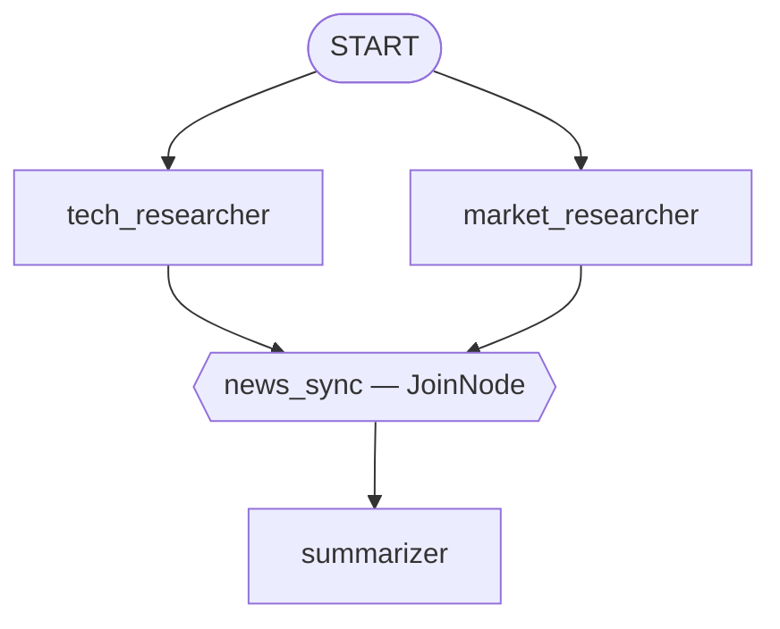

# Módulo 16: Orquestación Estática — Edges Lineales y Paralelos (Go) 🧩

## Teoría

### La Geometría de un Grafo: `workflow.Edge` 📐

Una orquestación determinística definida en código es, simplemente, un grafo de valores `workflow.Edge` — structs simples que conectan dos nodos:

```go
type Edge struct {
    From  Node
    To    Node
    Route Route
}
```

`workflow.Start` es el nodo centinela exportado para el punto de entrada de tu grafo. Encadena edges y correrán en secuencia — cada nodo espera educadamente a su predecesor:

```go
edges := []workflow.Edge{
    {From: workflow.Start, To: researcherNode},
    {From: researcherNode, To: writerNode},
    {From: writerNode, To: editorNode},
}
```

### Envolviendo un Agente como Nodo 🎁

`Edge.From`/`Edge.To` necesitan un `workflow.Node`, no un `agent.Agent` directamente. `workflow.NewAgentNode(a agent.Agent, cfg NodeConfig) (*AgentNode, error)` es tu adaptador:

```go
researcherNode, err := workflow.NewAgentNode(researcherAgent, workflow.NodeConfig{})
```

Cualquier `llmagent` simple funciona aquí — al grafo no le importa qué tipo de agente produjo la salida de un nodo.

### Fan-Out: Edges Paralelos 🌟

¿Quieres que algo corra al mismo tiempo? Solo apunta varios edges al mismo origen — no hace falta ningún constructo "paralelo" separado:

```go
edges := []workflow.Edge{
    {From: workflow.Start, To: techNode},    // arranca de inmediato
    {From: workflow.Start, To: marketNode},  // arranca al mismo tiempo
}
```

### Fan-In: `workflow.NewJoinNode` 🚦

`workflow.NewJoinNode(name string) *JoinNode` es una barrera de sincronización real y confirmada. Su propio comentario de documentación describe el contrato con precisión: "se activa exactamente una vez, después de que cada predecesor declarado por los edges del grafo se haya completado." Aquí va una advertencia genuinamente útil, vale la pena internalizarla antes de construir una: enrutar solo *a veces* hacia un `JoinNode` es un error de configuración — la barrera espera a cada predecesor declarado, y uno saltado por una ruta simplemente nunca la deja disparar. ⚠️

```go
syncer := workflow.NewJoinNode("news_sync")

edges := []workflow.Edge{
    {From: workflow.Start, To: techNode},
    {From: workflow.Start, To: marketNode},
    {From: techNode, To: syncer},
    {From: marketNode, To: syncer},
    {From: syncer, To: summarizerNode},
}
```

### El Grafo Completo, Visualizado 🗺️

Los cinco edges de arriba forman esta figura — generada para que coincida con la lista real `[]workflow.Edge` en `agent.go`, no una versión simplificada:



### Cómo Fluye Realmente la Data: `OutputKey`, No la Salida del Join 🔑

El propio método `Run` de `JoinNode` sí emite un `map[string]any` agregado (la salida de cada predecesor, indexada por nombre) — pero aquí va una sorpresa divertida, confirmada en vivo en este módulo: ¡eso no es lo que realmente lee un agente downstream! El mecanismo real es `llmagent.Config.OutputKey`, que escribe la respuesta final de un agente en el estado de la sesión bajo un nombre:

```go
techResearcher, _ := llmagent.New(llmagent.Config{
    Name:        "tech_researcher",
    Instruction: techInstruction,
    OutputKey:   "tech_news",
})
```

...combinado con interpolación real de `{key}` en la instrucción de un agente posterior — confirmado que funciona idéntico a Python:

```
Combine the following into a short, friendly newsletter:

Tech news: {tech_news}

Market news: {market_news}
```

El `JoinNode` en el medio es lo que *garantiza* que ambas keys ya estén pobladas para cuando se resuelva la instrucción del summarizer — su rol es puramente la barrera de sincronización, no un canal de datos.

### Construyendo Edges: Literales o Azúcar Sintáctico Real 🍬

`workflow.Edge{}` es un struct simple — escribir uno, como hace el propio `agent.go` de este módulo para los cinco edges, declara una conexión a la vez, sin rodeos. Pero el paquete también trae builders reales de conveniencia para exactamente las dos formas que necesita este laboratorio, confirmados presentes en el SDK fijado:

```go
workflow.Chain(startNode, techNode, syncer) // → []Edge{{startNode, techNode}, {techNode, syncer}}
```

`workflow.Chain(nodes ...Node) []Edge` genera los edges de una cadena a partir de una lista simple de nodos — el equivalente funcional directo del atajo de tupla de 3 elementos de Python `(A, B, C)`, solo que como una función independiente en vez de sintaxis especial de tupla. `workflow.NewEdgeBuilder().AddFanOut(from, a, b).AddFanIn(to, a, b).Build()` cubre la forma fan-out/fan-in que este mismo laboratorio construye. Este módulo escribe los cinco edges como literales explícitos por claridad pedagógica — para que cada conexión sea visible de un vistazo mientras aprendes el modelo — no porque no exista un atajo. 👀

### Envolviendo Todo el Grafo como un Agente 📦

`agent/workflowagent.New(workflowagent.Config{Name, Description, Edges: edges})` envuelve un `workflow.Workflow` como un `agent.Agent` simple — confirmado en vivo, corre a través de `runner.Run` y el launcher estándar exactamente igual que cualquier otro agente, sin cableado especial. ✅

### Puntos Clave
- `workflow.Edge{From, To, Route}` es la pieza básica del grafo — una cadena es secuencial, varios edges compartiendo un `From` hacen fan-out en paralelo.
- `workflow.NewAgentNode` adapta cualquier `agent.Agent` en un nodo del grafo.
- `workflow.NewJoinNode` es una barrera real de fan-in — se dispara exactamente una vez, después de cada predecesor declarado, nunca con un conjunto parcial.
- `OutputKey` + interpolación de instrucciones `{key}` transporta datos entre nodos — la salida agregada propia del `JoinNode` no es lo que un agente downstream típicamente lee.
- `agent/workflowagent.New` envuelve todo el grafo como un `agent.Agent` simple — sin manejo especial de runner o launcher.
- `workflow.Chain` y `EdgeBuilder.AddFanOut`/`AddFanIn` son funciones builder reales para las dos formas de edge que usa este laboratorio — los literales explícitos `Edge{}` son una decisión pedagógica aquí, no la única opción.

<hr/>

> **¿Vienes de Python?** 🐍 El `Workflow(edges=[(A, B, C)])` de Python acepta una tupla de 3 elementos como atajo para una cadena de dos edges; el equivalente directo en Go es la función independiente `workflow.Chain(A, B, C)`, llamada por separado en vez de estar embebida en sintaxis de tupla. Este laboratorio escribe valores explícitos `Edge{}` en su lugar, puramente por claridad mientras aprendes el modelo. Todo lo demás — cadenas secuenciales, fan-out paralelo, la barrera `JoinNode`, interpolación `output_key`/`{key}` — mapea directo.
