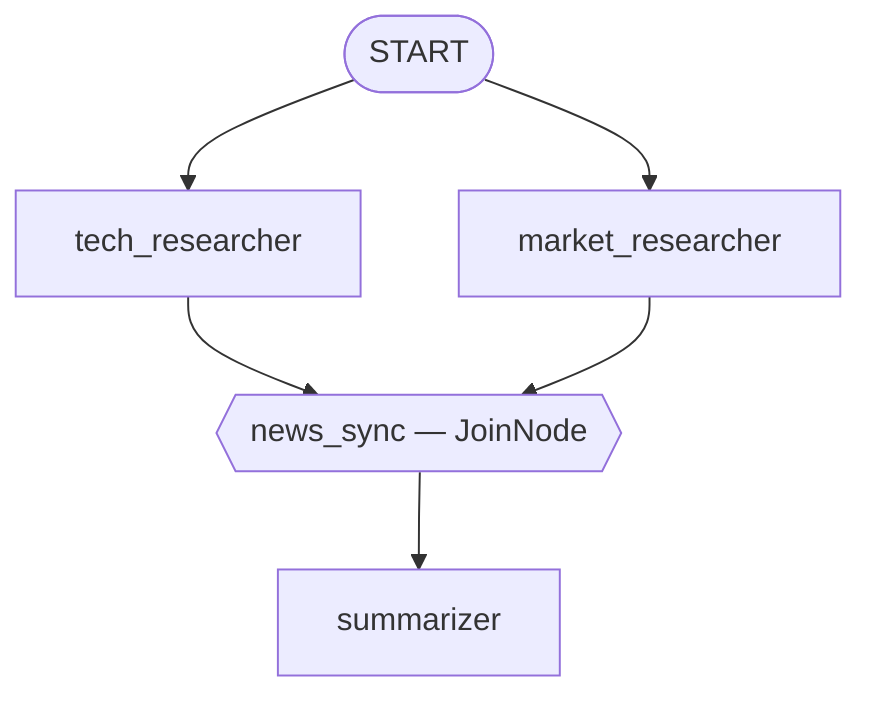

# Laboratorio 16: Construyendo un Agregador de Noticias Híbrido (Go) 📰

## Objetivo

¡Hora de construir de verdad el diseño de dos agentes del ejercicio en papel del módulo 15 — más un tercer agente y un grafo híbrido genuino: dos agentes de investigación corren en paralelo, convergen en un `JoinNode`, luego un summarizer corre secuencialmente. ¡Vamos! 🚀

### La Arquitectura



### Paso 1: Los Tres Agentes

El `BuildRootAgent` de `internal/agents/newsaggregator/agent.go` construye tres `llmagent`s simples — sin herramientas, sin capacidad de herramienta integrada, igual que el laboratorio original de Python (ninguno de los investigadores recibe una herramienta de búsqueda real aquí; esta lección es sobre la topología de orquestación, no sobre retrieval en vivo):

```go
techResearcher, _ := llmagent.New(llmagent.Config{
    Name:        "tech_researcher",
    Instruction: techInstruction, // "Find 3 recent headlines about AI and robotics..."
    OutputKey:   "tech_news",
})
marketResearcher, _ := llmagent.New(llmagent.Config{
    Name:        "market_researcher",
    Instruction: marketInstruction,
    OutputKey:   "market_news",
})
summarizer, _ := llmagent.New(llmagent.Config{
    Name:        "summarizer",
    Instruction: summarizerInstruction, // references {tech_news} and {market_news}
})
```

### Paso 2: Arma el Grafo Híbrido 🔧

```go
techNode, _ := workflow.NewAgentNode(techResearcher, workflow.NodeConfig{})
marketNode, _ := workflow.NewAgentNode(marketResearcher, workflow.NodeConfig{})
summarizerNode, _ := workflow.NewAgentNode(summarizer, workflow.NodeConfig{})
syncer := workflow.NewJoinNode("news_sync")

edges := []workflow.Edge{
    {From: workflow.Start, To: techNode},      // parallel branch 1
    {From: workflow.Start, To: marketNode},    // parallel branch 2
    {From: techNode, To: syncer},              // converge...
    {From: marketNode, To: syncer},            // ...both here
    {From: syncer, To: summarizerNode},        // sequential final step
}

rootAgent, _ := workflowagent.New(workflowagent.Config{Name: "NewsSystem", Edges: edges})
```

Cinco edges para un grafo híbrido de tres nodos — dos para el fan-out, dos para el fan-in, uno para el paso secuencial, escritos como literales explícitos `Edge{}` para que cada conexión sea visible de un vistazo. El README de este módulo muestra las alternativas reales con builders (`workflow.Chain`, `EdgeBuilder.AddFanOut`/`AddFanIn`) para las mismas formas.

### Paso 3: Corre y Verifica ▶️

```bash
go run ./cmd/news-aggregator console
```

Salida real y confirmada de este comando exacto (backend Gemini — mira la nota de abajo sobre por qué el modelo local se comporta distinto):

```
📰 news-aggregator using gemini-3.5-flash

User -> Give me today's update.
Agent -> 1. Toyota Partners with Boston Dynamics to Bring Advanced Artificial
Intelligence to the Atlas Humanoid Robot
2. Physical Intelligence Secures $400 Million in Funding to Develop a
Universal "Brain" Software for Diverse Robots
3. Nvidia Launches Project GR00T, a New AI Foundation Model Designed
Specifically for Humanoid Robot Development

[... market_researcher's own three headlines follow in the same event stream ...]

**Subject: The Weekly Buzz: Smart Robots, Market Highs, and More! 🤖📈**

Hey there, friends!
...
### 🤖 Tech Trends: The Rise of the Robots
* **Toyota & Boston Dynamics Team Up:** ...
### 💼 Market Watch: All-Time Highs & Shifting Trends
* **Record-Breaking Runs:** ...
```

Fíjate cómo el newsletter del summarizer realmente entreteje datos de *ambos* investigadores — esa es tu prueba de que el fan-out/fan-in realmente funcionó, no solo que el grafo no falló. ✅

### Una Diferencia Real y Confirmada Entre Backends 🔄

Como ninguno de los investigadores tiene una herramienta de búsqueda real, cada backend llena el vacío de forma distinta — confirmado en vivo, no asumido. El modelo local Ollama, al pedírsele "buscar titulares" sin manera real de buscar, honestamente declinó y ofreció fuentes alternativas en vez de inventar cualquier cosa (respeto 🙌). Gemini en cambio respondió con confianza desde su propio entrenamiento, produciendo titulares que suenan plausibles (pero no son reales). Ninguno está "mal" — este laboratorio busca probar que la topología del grafo funciona, no obtener noticias reales; el `google_search` del módulo 12 (solo Gemini) es la herramienta a la que recurrirías si el retrieval en vivo fuera el objetivo real, pero no puede compartir una lista `tools` con la configuración de herramientas personalizadas de estos agentes simples sin el mismo flag `IncludeServerSideToolInvocations` de ese módulo.

### Solución de Problemas 🛠️

Revisa [troubleshooting.md](./troubleshooting.md) si algún paso no se comporta como esperas.

### Resumen del Laboratorio 🎉

Construiste un grafo híbrido real: fan-out con edges paralelos simples, fan-in con `JoinNode`, y un paso final secuencial — todo cableado con `workflow.Edge`, y probado de punta a punta con un test que verifica que ambos `OutputKey`s realmente se poblaron, no solo que el grafo corrió sin error.

### Preguntas de Autorreflexión 🤔
- ¿Por qué el propio comentario de documentación de `JoinNode` llama a un enrutamiento condicional hacia él un error de configuración? ¿Qué pasaría si una de las dos ramas de investigación usara un `Route` que a veces la salteara?
- La instrucción del summarizer nunca toca directamente la salida agregada propia del `JoinNode`. ¿Qué garantiza realmente el `JoinNode`, si no los datos mismos?
- ¿Cómo agregarías una tercera rama paralela (digamos, un `sports_researcher`)? ¿Qué exactamente necesitarías agregar al slice de edges?

<hr/>

> **¿Vienes de Python?** 🐍 El tip del laboratorio de Python nota que una tupla de 3 elementos `(A, B, C)` es un atajo para dos edges. El equivalente directo en Go es `workflow.Chain(A, B, C)` — este laboratorio escribe cinco valores explícitos `Edge{From, To}` en su lugar, puramente por claridad mientras aprendes el modelo, no porque a Go le falte el atajo.
