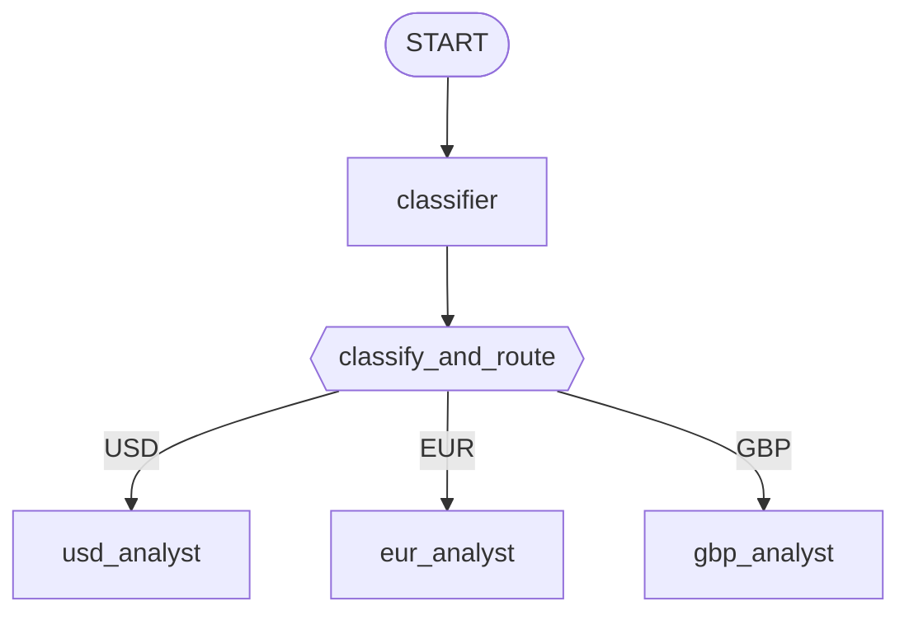

# Módulo 17: Enrutamiento Estructurado — Edges y Diccionarios (Go) 🔀

## Teoría

### Una Alternativa Más Liviana que un Grafo Totalmente Dinámico ⚖️

Los edges del módulo 16 están fijos desde el momento de la construcción — la forma del grafo nunca cambia en tiempo de ejecución. Un grafo totalmente dinámico (llega en un módulo posterior) deja que el código decida, paso a paso, qué nodo corre a continuación. El enrutamiento estructurado se ubica justo en el medio: la *forma* del grafo sigue siendo fija — cada rama posible se declara de antemano como un edge — pero *cuál* rama realmente se dispara depende de un valor que un nodo calcula mientras el grafo corre. Un paso de clasificación, varios destinos posibles, decidido por datos en vez de control de flujo escrito a mano. ¡Lindo, no?

### Configurando una Ruta: Devolviendo un Evento, No un Campo de Contexto 🎯

Una decisión de enrutamiento necesita un lugar donde vivir. Confirmado leyendo el propio método `Run` de `google.golang.org/adk/v2@v2.4.0/workflow/function_node.go`: un `FunctionNode` cuyo handler devuelve un `*session.Event` directamente hace que ese evento se emita tal cual, específicamente para que pueda cargar una decisión de enrutamiento en su campo `Routes []string`:

```go
func classifyAndRoute(ctx agent.Context, route MarketRoute) (*session.Event, error) {
    ev := session.NewEvent(ctx, ctx.InvocationID())
    ev.Routes = []string{route.Currency}
    ev.Output = route.Currency
    return ev, nil
}

classifyAndRouteNode := workflow.NewFunctionNode("classify_and_route", classifyAndRoute, workflow.NodeConfig{})
```

`workflow.StringRoute` (la implementación de `Route` que guarda el campo `Route` de un edge) hace match con un edge enrutado revisando si su valor string aparece en el slice `Routes` de un evento — así que configurar `ev.Routes = []string{"USD"}` aquí es lo que hace que el edge etiquetado con `USD` (y solo ese) se dispare a continuación.

### El Clasificador Es Su Propio Nodo 🧠

Una función de enrutamiento necesita su decisión de clasificación *antes* de poder actuar sobre ella, lo que plantea una pregunta de diseño: ¿debería llamarse al clasificador desde dentro del cuerpo de la propia función de enrutamiento, o cablearse como un paso separado del cual la función de enrutamiento simplemente recibe input?

Resulta que el SDK de Go resuelve esto por ti — solo una de estas formas realmente funciona. `workflow.RunNode[OUT any](ctx agent.Context, child Node, input any, opts ...RunNodeOption) (OUT, error)` — el mecanismo para invocar un nodo desde dentro del handler de otro — llama a `ctx.SubScheduler()` de inmediato y devuelve `ErrInvalidRunNodeContext` cuando es nil, confirmado leyendo `workflow/run_node.go` completo. Solo una activación de `workflow.NewDynamicNode` (módulo posterior de este curso) llega a poblar un sub-scheduler; el contexto de un `FunctionNode` o `AgentNode` simple nunca tiene uno. Así que invocar al clasificador desde dentro del propio handler de `classify_and_route` simplemente no está disponible aquí.

La forma de grafo a la que esto lleva es simple, y hasta más clara de leer que la alternativa: pon al clasificador en el grafo como su **propio nodo**, conectado por un edge simple hacia la función de enrutamiento. La salida del clasificador llega como el propio input tipado de la función de enrutamiento — el mismo flujo de datos nodo-a-nodo que el módulo 16 ya estableció, no algo que se busca imperativamente a mitad de función:

```go
classifierNode, _ := workflow.NewAgentNode(classifier, workflow.NodeConfig{})
// ...
edges := workflow.NewEdgeBuilder().
    Add(workflow.Start, classifierNode).
    Add(classifierNode, classifyAndRouteNode).
    // ...
```

Cada paso del pipeline — clasificar, luego enrutar — es visible directamente en la lista de edges, en vez de estar escondido dentro del cuerpo de una función. 👀

### No Hace Falta Parsear JSON a Mano 🎁

El clasificador se construye con `llmagent.Config.OutputSchema`, exactamente como el patrón de salida estructurada del módulo 4:

```go
var routeSchema = &genai.Schema{
    Type: genai.TypeObject,
    Properties: map[string]*genai.Schema{
        "currency": {Type: genai.TypeString, Enum: []string{"USD", "EUR", "GBP"}},
    },
    Required: []string{"currency"},
}

classifier, _ := llmagent.New(llmagent.Config{
    Name:         "classifier",
    Model:        llmModel,
    Instruction:  classifierInstruction,
    OutputSchema: routeSchema,
})
```

El módulo 4 encontró que `OutputSchema` solo le da forma a la *solicitud* — el SDK nunca valida ni parsea la respuesta JSON del chat del modelo, así que quien lee el texto crudo de una respuesta final tiene que hacer `json.Unmarshal` a mano. Aquí va el matiz, confirmado en vivo este módulo: ese hallazgo es sobre leer una **respuesta de chat**, no sobre la **salida propia de un nodo de workflow fluyendo hacia su sucesor**. Cuando `classifyAndRoute` se declara con un struct simple como su propio tipo de input —

```go
func classifyAndRoute(ctx agent.Context, route MarketRoute) (*session.Event, error) {
```

— el propio camino de coerción de input de `FunctionNode` convierte el resultado estructurado del clasificador directamente en ese struct antes de que el handler siquiera corra. Probado en vivo (`temp/module-17/probe/main.go`): la función recibió `MarketRoute{Currency: "GBP"}` completamente poblado, sin ningún unmarshaling manual en el handler. ¡Un lindo extra! ✨

### El Diccionario de Enrutamiento: `EdgeBuilder.AddRoutes` 🗺️

Los tres edges enrutados — de `classify_and_route` hacia cada uno de `usd_analyst`/`eur_analyst`/`gbp_analyst`, uno por moneda — comparten un solo nodo origen y difieren solo en qué string de ruta hacen match. `workflow.EdgeBuilder.AddRoutes` construye exactamente esta forma a partir de un map, confirmado presente en el SDK fijado (`workflow/edgebuilder.go`):

```go
func (b *EdgeBuilder) AddRoutes(from Node, routes map[string]Node) *EdgeBuilder {
    for route, to := range routes {
        b.AddRoute(from, to, StringRoute(route))
    }
    return b
}
```

```go
edges := workflow.NewEdgeBuilder().
    Add(workflow.Start, classifierNode).
    Add(classifierNode, classifyAndRouteNode).
    AddRoutes(classifyAndRouteNode, map[string]workflow.Node{
        "USD": usdNode,
        "EUR": eurNode,
        "GBP": gbpNode,
    }).
    Build()
```

La misma forma también se puede expresar como literales explícitos `Edge{}`, uno por moneda, todos compartiendo el mismo `From` — vale la pena saberlo, ya que es justamente en lo que se expande `AddRoutes` por dentro:

```go
edges := []workflow.Edge{
    {From: workflow.Start, To: classifierNode},
    {From: classifierNode, To: classifyAndRouteNode},
    {From: classifyAndRouteNode, To: usdNode, Route: workflow.StringRoute("USD")},
    {From: classifyAndRouteNode, To: eurNode, Route: workflow.StringRoute("EUR")},
    {From: classifyAndRouteNode, To: gbpNode, Route: workflow.StringRoute("GBP")},
}
```

### El Grafo Completo, Visualizado 🗺️

Generado para que coincida con la lista real de edges en `internal/agents/marketrouter/agent.go`, no una versión simplificada:



Solo uno de los tres edges enrutados se dispara por corrida — el que coincide con la decisión real del clasificador.

### Flujo de Datos vs. Enrutamiento: Dos Preguntas Separadas 🤹

Si la *salida* de un nodo fluye downstream, y *cuál* nodo downstream la recibe, son decisiones independientes. La salida de `classify_and_route` (`ev.Output`) es cualquier valor que el handler configure en el evento devuelto — aquí, solo el string de la moneda que hizo match, no el texto original de la solicitud del usuario. Eso alcanza para este módulo, porque la instrucción de cada especialista es estática y autocontenida (un analista de EUR no necesita ver la redacción exacta que lo disparó) — un diseño de especialista distinto que necesitara la solicitud original configuraría `ev.Output` con eso en su lugar. Cuál especialista realmente recibe la salida se decide puramente por si `ev.Routes` hace match con el `Route` de un edge. Nada sobre la forma de los edges de enrutamiento afecta qué datos se mueven; nada sobre el valor de salida afecta cuál edge se dispara.

### Rareza Conocida del Backend Local 🐛

Un modelo local capaz de razonar puede filtrar su propio texto de cadena de pensamiento hacia la salida visible de un nodo (confirmado en `qwen3.8:27b`) — una diferencia real y confirmada entre backends. Ver [troubleshooting.md](./troubleshooting.md).

### Puntos Clave ✅
- El enrutamiento estructurado es una alternativa más liviana a un workflow totalmente dinámico: la forma del grafo sigue fija desde la construcción, pero el valor de retorno de una función de enrutamiento decide qué rama se dispara.
- Configurar una ruta significa devolver un `*session.Event` con `.Routes` poblado desde el handler de un `FunctionNode` — no asignar un campo de contexto.
- `workflow.RunNode` genuinamente requiere el sub-scheduler de un nodo dinámico — no hay forma de invocar un sub-nodo desde el handler de un nodo simple. El clasificador pertenece al grafo como su propio nodo en su lugar.
- El tipo de input declarado de un `FunctionNode` puede ser un struct simple — el SDK convierte automáticamente la salida estructurada de un predecesor en ese struct, sin parseo manual de JSON.
- `workflow.EdgeBuilder.AddRoutes(from, map[string]Node{...})` construye un conjunto completo de edges enrutados a partir de un solo map — la forma de diccionario-enrutador que necesita el grafo de este módulo.

<hr/>

> **¿Vienes de Python?** 🐍 `ctx.route = "USD"` de Python configura la decisión de enrutamiento en el propio contexto de ejecución del nodo, y `ctx.run_node(classifier, node_input)` puede invocar otro nodo de forma imperativa desde dentro de cualquier función `@node`, grafo estático o dinámico. Go no tiene equivalente para ninguno de los dos: una ruta se configura devolviendo un `*session.Event` con `.Routes` poblado, y `workflow.RunNode` solo funciona dentro del propio cuerpo de un `workflow.NewDynamicNode` — así que el clasificador aquí se cablea como su propio nodo del grafo en vez de invocarse desde dentro de `classify_and_route`. El propio edge de diccionario, sin embargo, mapea directo: `workflow.EdgeBuilder.AddRoutes(classifyAndRouteNode, map[string]workflow.Node{...})` es exactamente el `(classify_and_route, {"USD": usd_analyst, ...})` de Python.
