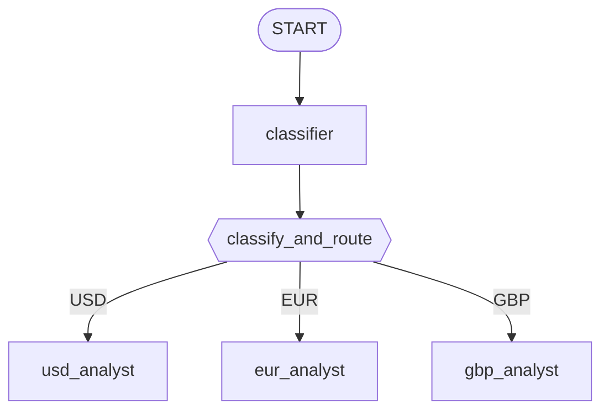

# Module 17: Structured Routing — Edges and Dictionaries (Go) 🔀

## Theory

### A Lighter-Weight Alternative to a Fully Dynamic Graph ⚖️

Module-16's edges are fixed at construction time — the graph's shape never changes at runtime. A fully dynamic graph (coming up in a later module) lets code decide, step by step, which node runs next. Structured routing sits neatly in between: the graph's *shape* is still fixed — every possible branch is declared up front as an edge — but *which* branch actually fires depends on a value one node computes while the graph runs. One classification step, several possible destinations, decided by data rather than hand-written control flow. Nice, right?

### Setting a Route: Returning an Event, Not a Context Field 🎯

A routing decision needs somewhere to live. Confirmed by reading `google.golang.org/adk/v2@v2.4.0/workflow/function_node.go`'s own `Run` method: a `FunctionNode` whose handler returns a `*session.Event` directly gets that event yielded as-is, specifically so it can carry a routing decision on its `Routes []string` field:

```go
func classifyAndRoute(ctx agent.Context, route MarketRoute) (*session.Event, error) {
    ev := session.NewEvent(ctx, ctx.InvocationID())
    ev.Routes = []string{route.Currency}
    ev.Output = route.Currency
    return ev, nil
}

classifyAndRouteNode := workflow.NewFunctionNode("classify_and_route", classifyAndRoute, workflow.NodeConfig{})
```

`workflow.StringRoute` (the `Route` implementation an edge's `Route` field holds) matches a routed edge by checking whether its string value appears in an event's `Routes` slice — so setting `ev.Routes = []string{"USD"}` here is what makes the `USD`-tagged edge (and only that one) fire next.

### The Classifier Is Its Own Node 🧠

A routing function needs its classifying decision *before* it can act on it, which raises a design question: should the classifier be called from inside the routing function's own body, or wired as a separate step the routing function simply receives input from?

Turns out Go's SDK settles this for you — only one of these shapes actually works. `workflow.RunNode[OUT any](ctx agent.Context, child Node, input any, opts ...RunNodeOption) (OUT, error)` — the mechanism for invoking one node from inside another's handler — calls `ctx.SubScheduler()` immediately and returns `ErrInvalidRunNodeContext` when it's nil, confirmed by reading `workflow/run_node.go` in full. Only an activation of `workflow.NewDynamicNode` (this course's later module) ever populates a sub-scheduler; a plain `FunctionNode`'s or `AgentNode`'s context never has one. So invoking the classifier from inside `classify_and_route`'s own handler simply isn't on the menu here.

The graph shape this leads to is simple, and arguably clearer to read than the alternative would've been anyway: put the classifier in the graph as its **own node**, connected by a plain edge into the routing function. The classifier's output arrives as the routing function's own typed input — the same node-to-node data flow module-16 already established, not something fetched imperatively mid-function:

```go
classifierNode, _ := workflow.NewAgentNode(classifier, workflow.NodeConfig{})
// ...
edges := workflow.NewEdgeBuilder().
    Add(workflow.Start, classifierNode).
    Add(classifierNode, classifyAndRouteNode).
    // ...
```

Every step in the pipeline — classify, then route — is visible directly in the edge list, rather than hidden inside one function's body. 👀

### No Manual JSON Parsing Needed 🎁

The classifier is built with `llmagent.Config.OutputSchema`, exactly like module-4's structured-output pattern:

```go
var routeSchema = &genai.Schema{
    Type: genai.TypeObject,
    Properties: map[string]*genai.Schema{
        "currency": {Type: genai.TypeString, Enum: []string{"USD", "EUR", "GBP"}},
    },
    Required: []string{"currency"},
}

classifier, _ := llmagent.New(llmagent.Config{
    Name:         "classifier",
    Model:        llmModel,
    Instruction:  classifierInstruction,
    OutputSchema: routeSchema,
})
```

Module-4 found that `OutputSchema` only shapes the *request* — the SDK never validates or parses the model's JSON *chat* reply, so a caller reading a final response's raw text has to `json.Unmarshal` it by hand. Here's the nuance, confirmed live this module: that finding is about reading a **chat response**, not about a **workflow node's own output flowing to its successor**. When `classifyAndRoute` is declared with a plain struct as its own input type —

```go
func classifyAndRoute(ctx agent.Context, route MarketRoute) (*session.Event, error) {
```

— the SDK's own `FunctionNode` input-coercion path converts the classifier's structured result directly into that struct before the handler ever runs. Proven live (`temp/module-17/probe/main.go`): the function received `MarketRoute{Currency: "GBP"}` fully populated, with zero manual unmarshaling required in the handler at all. Nice little perk! ✨

### The Router Dictionary: `EdgeBuilder.AddRoutes` 🗺️

The three routed edges — `classify_and_route` to each of `usd_analyst`/`eur_analyst`/`gbp_analyst`, one per currency — share a single source node and differ only by which route string they match. `workflow.EdgeBuilder.AddRoutes` builds exactly this shape from a map, confirmed present in the pinned SDK (`workflow/edgebuilder.go`):

```go
func (b *EdgeBuilder) AddRoutes(from Node, routes map[string]Node) *EdgeBuilder {
    for route, to := range routes {
        b.AddRoute(from, to, StringRoute(route))
    }
    return b
}
```

```go
edges := workflow.NewEdgeBuilder().
    Add(workflow.Start, classifierNode).
    Add(classifierNode, classifyAndRouteNode).
    AddRoutes(classifyAndRouteNode, map[string]workflow.Node{
        "USD": usdNode,
        "EUR": eurNode,
        "GBP": gbpNode,
    }).
    Build()
```

The same shape is also expressible as explicit `Edge{}` literals, one per currency, all sharing the same `From` — worth knowing since it's what `AddRoutes` itself expands into under the hood:

```go
edges := []workflow.Edge{
    {From: workflow.Start, To: classifierNode},
    {From: classifierNode, To: classifyAndRouteNode},
    {From: classifyAndRouteNode, To: usdNode, Route: workflow.StringRoute("USD")},
    {From: classifyAndRouteNode, To: eurNode, Route: workflow.StringRoute("EUR")},
    {From: classifyAndRouteNode, To: gbpNode, Route: workflow.StringRoute("GBP")},
}
```

### The Full Graph, Visualized 🗺️

Generated to match the real edge list in `internal/agents/marketrouter/agent.go`, not a simplified version of it:



Only one of the three routed edges fires per run — the one whose `Route` matches the classifier's actual decision.

### Data Flow vs. Routing: Two Separate Questions 🤹

Whether a node's *output* flows downstream, and *which* downstream node receives it, are decided independently. `classify_and_route`'s output (`ev.Output`) is whatever value the handler sets on the returned event — here, just the matched currency string, not the user's original request text. That's plenty for this module, because each specialist's own instruction is static and self-contained (a EUR analyst doesn't need to see the exact wording that triggered it) — a different specialist design that needed the original request would set `ev.Output` to that instead. Which specialist actually receives the output is decided purely by `ev.Routes` matching an edge's `Route`. Nothing about the routing edges' shape affects what data moves; nothing about the output value affects which edge fires.

### Known Local-Backend Quirk 🐛

A reasoning-capable local model can leak its own chain-of-thought text into a node's visible output (confirmed on `qwen3.8:27b`) — a real, confirmed cross-backend difference. See [troubleshooting.md](./troubleshooting.md).

### Key Takeaways ✅
- Structured routing is a lighter-weight alternative to a full dynamic workflow: the graph's shape is still fixed at construction time, but a routing function's return value decides which branch fires.
- Setting a route means returning a `*session.Event` with `.Routes` populated from a `FunctionNode`'s handler — not assigning a context field.
- `workflow.RunNode` genuinely requires a dynamic node's sub-scheduler — there is no way to invoke a sub-node from inside a plain node's handler. The classifier belongs in the graph as its own node instead.
- A `FunctionNode`'s declared input type can be a plain struct — the SDK converts a predecessor's structured output into it automatically, no manual JSON parsing needed.
- `workflow.EdgeBuilder.AddRoutes(from, map[string]Node{...})` builds a whole set of routed edges from one map — the router-dictionary shape this module's graph needs.

<hr/>

> **Coming from Python?** 🐍 Python's `ctx.route = "USD"` sets the routing decision on the node's own execution context, and `ctx.run_node(classifier, node_input)` can invoke another node imperatively from inside any `@node` function, static graph or dynamic. Go has no equivalent to either: a route is set by returning a `*session.Event` with `.Routes` populated, and `workflow.RunNode` only works inside a `workflow.NewDynamicNode`'s own body — so the classifier here is wired as its own graph node rather than invoked from inside `classify_and_route`. The dict-as-edge-target itself (`(classify_and_route, {"USD": usd_analyst, ...})`) maps directly onto `workflow.EdgeBuilder.AddRoutes`.
