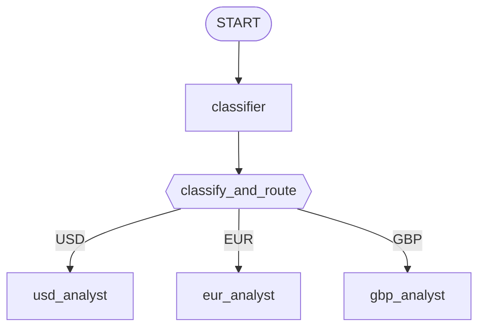

# Laboratorio 17: Construyendo un Enrutador de Mercado (Go) 💱

## Objetivo

Construye un grafo de enrutamiento guiado por un clasificador: un nodo clasificador decide de qué moneda trata una solicitud, luego una pequeña función de enrutamiento dirige la solicitud hacia el especialista correcto — USD, EUR o GBP. 🚀

### La Arquitectura



### Paso 1: El Tipo de Ruta Estructurado

`internal/agents/marketrouter/agent.go` define el resultado estructurado del clasificador y el schema que lo restringe — sincronizados a mano, siguiendo el mismo precedente de `supportanalyzer`:

```go
type MarketRoute struct {
    Currency string `json:"currency"`
}

var routeSchema = &genai.Schema{
    Type: genai.TypeObject,
    Properties: map[string]*genai.Schema{
        "currency": {Type: genai.TypeString, Enum: []string{"USD", "EUR", "GBP"}},
    },
    Required: []string{"currency"},
}
```

### Paso 2: Los Cuatro Agentes 🧑‍🤝‍🧑

```go
classifier, _ := llmagent.New(llmagent.Config{
    Name:         "classifier",
    Instruction:  classifierInstruction, // "Identify which currency the user's request is about..."
    OutputSchema: routeSchema,
})
usdAnalyst, _ := llmagent.New(llmagent.Config{Name: "usd_analyst", Instruction: usdInstruction})
eurAnalyst, _ := llmagent.New(llmagent.Config{Name: "eur_analyst", Instruction: eurInstruction})
gbpAnalyst, _ := llmagent.New(llmagent.Config{Name: "gbp_analyst", Instruction: gbpInstruction})
```

### Paso 3: La Función de Enrutamiento 🎯

El trabajo de `classify_and_route`: leer la decisión ya tipada del clasificador, y devolver un evento que lleve la señal de enrutamiento. No hace falta una sub-llamada imperativa al estilo `ctx.run_node` — el clasificador ya corrió como su propio nodo del grafo para cuando llega el input de esta función:

```go
func classifyAndRoute(ctx agent.Context, route MarketRoute) (*session.Event, error) {
    ev := session.NewEvent(ctx, ctx.InvocationID())
    ev.Routes = []string{route.Currency}
    ev.Output = route.Currency
    return ev, nil
}

classifyAndRouteNode := workflow.NewFunctionNode("classify_and_route", classifyAndRoute, workflow.NodeConfig{})
```

### Paso 4: Arma el Grafo 🧩

```go
classifierNode, _ := workflow.NewAgentNode(classifier, workflow.NodeConfig{})
usdNode, _ := workflow.NewAgentNode(usdAnalyst, workflow.NodeConfig{})
eurNode, _ := workflow.NewAgentNode(eurAnalyst, workflow.NodeConfig{})
gbpNode, _ := workflow.NewAgentNode(gbpAnalyst, workflow.NodeConfig{})

edges := workflow.NewEdgeBuilder().
    Add(workflow.Start, classifierNode).
    Add(classifierNode, classifyAndRouteNode).
    AddRoutes(classifyAndRouteNode, map[string]workflow.Node{
        "USD": usdNode,
        "EUR": eurNode,
        "GBP": gbpNode,
    }).
    Build()

rootAgent, _ := workflowagent.New(workflowagent.Config{Name: "MarketRouter", Edges: edges})
```

### Paso 5: Corre y Verifica ▶️

```bash
go run ./cmd/market-router console
```

Salida real y confirmada de este comando exacto (backend Gemini):

```
💱 market-router using gemini-3.5-flash

User -> Give me an analysis in Euros please.
Agent -> {"currency": "EUR"}EUR Analysis:
The Euro remains under pressure as economic growth concerns in the Eurozone conflict with
the ECB's hawkish stance on inflation. However, stable labor markets continue to provide a
floor for the currency against its major peers.
```

La decisión JSON cruda del propio clasificador y la respuesta del especialista enrutado aparecen en el mismo flujo de eventos — prueba de que el grafo realmente enrutó hacia `eur_analyst`, no una coincidencia. Prueba con un mensaje distinto (p. ej. "What about British Pounds?") y confirma que aparece el marcador `"GBP Analysis:"` de `gbp_analyst`. 🎯

### Paso 6: Un Test Real y Confirmado 🧪

El test en vivo de `agent_test.go` maneja las tres solicitudes de moneda a través del grafo real y verifica que el texto marcador del especialista *correcto* esté presente — y que ningún marcador de otro especialista se haya filtrado, comparando contra una lista fija de todos los marcadores en vez de listar "los otros dos" en cada caso:

```go
allMarkers := []string{"USD Analysis:", "EUR Analysis:", "GBP Analysis:"}

cases := []struct {
    message    string
    wantMarker string
}{
    {message: "I'd like an analysis in British Pounds please.", wantMarker: "GBP Analysis:"},
    {message: "Give me an analysis in US Dollars.", wantMarker: "USD Analysis:"},
    {message: "Give me an analysis in Euros please.", wantMarker: "EUR Analysis:"},
}
```

Esto es mucho más sólido que solo verificar que el grafo terminó — un bug de enrutamiento que siempre terminara en el mismo especialista igual pasaría sin error, y este test lo detectaría sin problema. 💪

### Solución de Problemas 🛠️

Revisa [troubleshooting.md](./troubleshooting.md) si algún paso no se comporta como esperas.

### Resumen del Laboratorio 🎉

Construiste un grafo real de enrutamiento estructurado: un nodo clasificador alimentando una función de enrutamiento que fija su decisión devolviendo un `*session.Event` con `.Routes` poblado, cableado a tres especialistas vía `workflow.EdgeBuilder.AddRoutes` — probado en vivo, con un test que verifica *cuál* especialista realmente respondió, no solo que el grafo corrió sin error.

### Preguntas de Autorreflexión 🤔
- ¿Por qué `classify_and_route` recibe la decisión del clasificador como input de función, en vez de llamar al clasificador desde dentro de su propio handler? ¿Qué mecanismo de Go requeriría invocar otro nodo de forma imperativa, y qué módulo lo introduce?
- El input de `classify_and_route` se declara como un struct simple `MarketRoute`, no `map[string]any` ni `string`. ¿Qué está realmente convirtiendo la salida cruda del clasificador en ese struct, y dónde pasa eso en relación a tu propio código del handler?
- ¿Cómo agregarías una cuarta moneda (digamos, JPY)? ¿Qué exactamente necesitarías agregar a los edges, y el propio código de `classify_and_route` necesitaría cambiar en algo?

<hr/>

> **¿Vienes de Python?** 🐍 El laboratorio de Python envuelve `classify_and_route` como una función `@node` que llama a `ctx.run_node(classifier, node_input)` internamente, lee `result["currency"]`, y configura `ctx.route` antes de devolver el input original sin cambios. Este laboratorio de Go en cambio cablea al clasificador como su propio nodo del grafo (`workflow.RunNode` solo funciona dentro del cuerpo de un nodo dinámico, confirmado que no se puede usar aquí), y configura la ruta devolviendo un `*session.Event` con `.Routes` poblado — una diferencia estructural genuina, no de estilo. El propio edge de diccionario-enrutador, sin embargo, mapea directo: `workflow.EdgeBuilder.AddRoutes(classifyAndRouteNode, map[string]workflow.Node{...})` es exactamente el `(classify_and_route, {"USD": usd_analyst, ...})` de Python.
