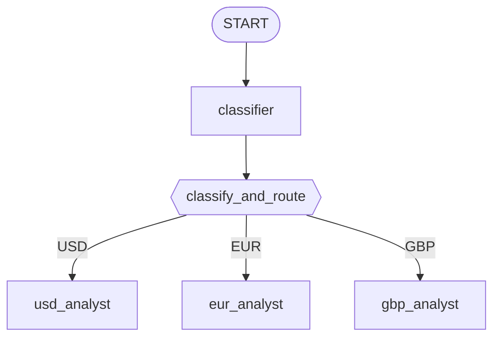

# Lab 17: Building a Market Router (Go) 💱

## Goal

Build a classifier-driven routing graph: one classifier node decides which currency a request is about, then a small routing function directs the request to the matching specialist — USD, EUR, or GBP. 🚀

### The Architecture



### Step 1: The Structured Route Type

`internal/agents/marketrouter/agent.go` defines the classifier's structured result and the schema constraining it — kept in sync by hand, matching `supportanalyzer`'s own precedent:

```go
type MarketRoute struct {
    Currency string `json:"currency"`
}

var routeSchema = &genai.Schema{
    Type: genai.TypeObject,
    Properties: map[string]*genai.Schema{
        "currency": {Type: genai.TypeString, Enum: []string{"USD", "EUR", "GBP"}},
    },
    Required: []string{"currency"},
}
```

### Step 2: The Four Agents 🧑‍🤝‍🧑

```go
classifier, _ := llmagent.New(llmagent.Config{
    Name:         "classifier",
    Instruction:  classifierInstruction, // "Identify which currency the user's request is about..."
    OutputSchema: routeSchema,
})
usdAnalyst, _ := llmagent.New(llmagent.Config{Name: "usd_analyst", Instruction: usdInstruction})
eurAnalyst, _ := llmagent.New(llmagent.Config{Name: "eur_analyst", Instruction: eurInstruction})
gbpAnalyst, _ := llmagent.New(llmagent.Config{Name: "gbp_analyst", Instruction: gbpInstruction})
```

### Step 3: The Routing Function 🎯

`classify_and_route`'s job: read the classifier's already-typed decision, and return an event carrying the routing signal. No `ctx.run_node`-style imperative sub-call needed — the classifier already ran as its own graph node by the time this function's input arrives:

```go
func classifyAndRoute(ctx agent.Context, route MarketRoute) (*session.Event, error) {
    ev := session.NewEvent(ctx, ctx.InvocationID())
    ev.Routes = []string{route.Currency}
    ev.Output = route.Currency
    return ev, nil
}

classifyAndRouteNode := workflow.NewFunctionNode("classify_and_route", classifyAndRoute, workflow.NodeConfig{})
```

### Step 4: Assemble the Graph 🧩

```go
classifierNode, _ := workflow.NewAgentNode(classifier, workflow.NodeConfig{})
usdNode, _ := workflow.NewAgentNode(usdAnalyst, workflow.NodeConfig{})
eurNode, _ := workflow.NewAgentNode(eurAnalyst, workflow.NodeConfig{})
gbpNode, _ := workflow.NewAgentNode(gbpAnalyst, workflow.NodeConfig{})

edges := workflow.NewEdgeBuilder().
    Add(workflow.Start, classifierNode).
    Add(classifierNode, classifyAndRouteNode).
    AddRoutes(classifyAndRouteNode, map[string]workflow.Node{
        "USD": usdNode,
        "EUR": eurNode,
        "GBP": gbpNode,
    }).
    Build()

rootAgent, _ := workflowagent.New(workflowagent.Config{Name: "MarketRouter", Edges: edges})
```

### Step 5: Run and Verify ▶️

```bash
go run ./cmd/market-router console
```

Real, confirmed output from this exact command (Gemini backend):

```
💱 market-router using gemini-3.5-flash

User -> Give me an analysis in Euros please.
Agent -> {"currency": "EUR"}EUR Analysis:
The Euro remains under pressure as economic growth concerns in the Eurozone conflict with
the ECB's hawkish stance on inflation. However, stable labor markets continue to provide a
floor for the currency against its major peers.
```

The classifier's own raw JSON decision and the routed specialist's answer both appear in the same event stream — proof the graph genuinely routed to `eur_analyst`, not a coincidence. Try a different message (e.g. "What about British Pounds?") and confirm `gbp_analyst`'s `"GBP Analysis:"` marker appears instead. 🎯

### Step 6: A Real, Confirmed Test 🧪

`agent_test.go`'s live test drives all three currency requests through the real graph and checks the *correct* specialist's marker text is present — and that neither other specialist's marker leaked in, checked against one fixed list of every marker rather than hand-listing "the other two" per case:

```go
allMarkers := []string{"USD Analysis:", "EUR Analysis:", "GBP Analysis:"}

cases := []struct {
    message    string
    wantMarker string
}{
    {message: "I'd like an analysis in British Pounds please.", wantMarker: "GBP Analysis:"},
    {message: "Give me an analysis in US Dollars.", wantMarker: "USD Analysis:"},
    {message: "Give me an analysis in Euros please.", wantMarker: "EUR Analysis:"},
}
```

This is way stronger than checking the graph merely completed — a routing bug that always fell through to the same specialist would still finish without error, and this test would totally catch it. 💪

### Troubleshooting 🛠️

See [troubleshooting.md](./troubleshooting.md) if a step doesn't behave as expected.

### Lab Summary 🎉

You built a real structured-routing graph: a classifier node feeding a routing function that sets its decision by returning a `*session.Event` with `.Routes` populated, wired to three specialists via `workflow.EdgeBuilder.AddRoutes` — proven live, with a test that checks *which* specialist actually answered, not just that the graph ran without error.

### Self-Reflection Questions 🤔
- Why does `classify_and_route` receive the classifier's decision as a function input, rather than calling the classifier itself from inside its own handler? What Go mechanism would invoking another node imperatively require, and what module introduces it?
- `classify_and_route`'s input is declared as a plain `MarketRoute` struct, not `map[string]any` or `string`. What is actually converting the classifier's raw output into that struct, and where does that happen relative to your own handler code?
- How would you add a fourth currency (say, JPY)? What exactly would you need to add to the edges, and would `classify_and_route`'s own code need to change at all?

<hr/>

> **Coming from Python?** 🐍 Python's lab wraps `classify_and_route` as an `@node` function that calls `ctx.run_node(classifier, node_input)` internally, reads `result["currency"]`, and sets `ctx.route` before returning the original input unchanged. This Go lab instead wires the classifier as its own graph node (`workflow.RunNode` only works inside a dynamic node's body, confirmed not usable here), and sets the route by returning a `*session.Event` with `.Routes` populated — a genuine structural difference, not a stylistic one. The router-dictionary edge itself, though, maps directly: `workflow.EdgeBuilder.AddRoutes(classifyAndRouteNode, map[string]workflow.Node{...})` is exactly Python's `(classify_and_route, {"USD": usd_analyst, ...})`.
