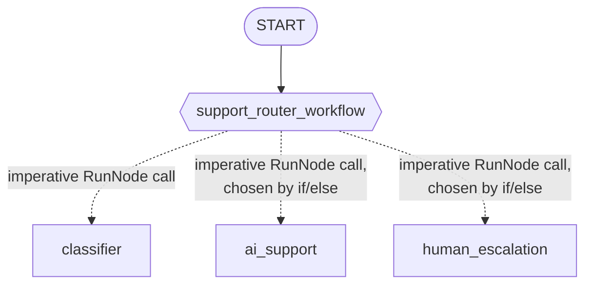

# Módulo 18: Orquestación Dinámica — Grafos Programables (Go) 🎛️

## Teoría

### Cuando la Lista de Edges No Alcanza 🧩

Los edges del módulo 16 son secuencias y fan-outs fijos. El diccionario enrutador del módulo 17 elige uno de varios destinos fijos haciendo match con un valor. Ambos describen cada camino posible por el grafo de antemano, como datos. Pero algunas decisiones de enrutamiento simplemente no encajan en esa forma — una decisión que necesita un loop, un reintento, varias sub-decisiones secuenciales, o lógica condicional común que es mucho más fácil de escribir como código que de codificar como edges. La orquestación dinámica es el patrón para exactamente eso: un nodo cuyo cuerpo *es* código Go, decidiendo en tiempo de ejecución, en el orden que quiera, qué otros nodos correr.

### `workflow.NewDynamicNode`: Un Nodo Cuyo Cuerpo Corre Otros Nodos 🏃

```go
func NewDynamicNode[IN, OUT any](name string, fn DynamicFn[IN, OUT], cfg NodeConfig) Node
```

`DynamicFn[IN, OUT] = func(ctx agent.Context, in IN, emit func(*session.Event) error) (OUT, error)` — simplemente una función Go ordinaria. Su propio comentario de documentación lo dice directamente: "envuelve fn como un Node de workflow cuyo orden de ejecución se expresa como código Go llamando a `RunNode` por cada hijo."

### `workflow.RunNode`: Llamando a Otro Nodo Desde Dentro de Uno 📞

```go
func RunNode[OUT any](ctx agent.Context, child Node, input any, opts ...RunNodeOption) (OUT, error)
```

Este es el mecanismo que deja que el cuerpo de un nodo dinámico invoque otro nodo de forma imperativa y obtenga su resultado directamente, a mitad de función — confirmado en vivo en el probe de este módulo, y confirmado leyendo `workflow/run_node.go`: `RunNode` busca un sub-scheduler en `ctx` y lo usa para correr a `child`. Una activación de `NewDynamicNode` es el único contexto que realmente tiene ese sub-scheduler; el contexto de un `FunctionNode` o `AgentNode` simple nunca lo tiene (la exacta restricción con la que se topó el módulo 17, y que resolvió haciendo de su clasificador un nodo separado del grafo). Aquí, con un nodo dinámico genuino, no hay restricción que resolver — el clasificador simplemente se invoca directamente:

```go
supportRouterWorkflow := workflow.NewDynamicNode("support_router_workflow",
    func(ctx agent.Context, input string, emit func(*session.Event) error) (string, error) {
        classification, err := workflow.RunNode[map[string]any](ctx, classifierNode, input)
        if err != nil {
            return "", err
        }

        chosen := aiSupportNode
        if classification["sentiment"] == "angry" {
            chosen = humanEscalationNode
        }

        return workflow.RunNode[string](ctx, chosen, input)
    },
    workflow.NodeConfig{},
)
```

### Una Trampa Genuina: El Tipo de Salida de `RunNode` Es una Aserción Simple, No una Conversión de Schema ⚠️

`classifier` se construye con `llmagent.Config.OutputSchema`, restringiendo su respuesta final a `{"sentiment": "angry"|"neutral"|"happy"}`. Es tentador declarar `workflow.RunNode[SentimentClassification](...)` contra un struct de Go que haga match — ¡pero eso falla! Confirmado en vivo: la implementación de `RunNode` hace una simple aserción de tipo de Go (`rawOut.(OUT)`) sobre la salida cruda del nodo hijo, sin ningún fallback de conversión consciente de schema. Esta es una diferencia genuina y confirmada respecto al propio manejo de input de `workflow.NewFunctionNode` (el hallazgo del módulo 17), que *sí* convierte automáticamente la salida estructurada de un predecesor en un struct declarado. `RunNode` no hace eso — el resultado estructurado del clasificador llega como un `map[string]any` simple, y la única forma de llamada que realmente funciona es:

```go
classification, err := workflow.RunNode[map[string]any](ctx, classifierNode, input)
// classification["sentiment"], not a typed field
```

Probar `RunNode[SentimentClassification]` contra el mismo nodo falla en tiempo de ejecución con `"output type map[string]interface {} does not satisfy expected ... SentimentClassification"` — confirmado corriendo exactamente esa llamada en el propio probe de este módulo. ¡Bueno que lo revisamos! 🔍

### La Decisión de Enrutamiento Vive en Código Go, No en la Lista de Edges 💡

Todo el grafo estático de este módulo es un solo edge:



Las flechas punteadas no son edges del grafo — no hay ningún `workflow.Edge` conectando `support_router_workflow` con ninguno de los tres nodos de agente. Representan llamadas que el propio código Go del nodo dinámico hace en tiempo de ejecución, en el orden y bajo la condición que decida el cuerpo de la función. Leer solo la lista de edges mostraría únicamente la flecha sólida; la lógica real de enrutamiento vive por completo dentro del cuerpo de la función de `support_router_workflow`.

### `RerunOnResume`: Ya Es el Default Correcto 🎁

`workflow.NodeConfig.RerunOnResume *bool` controla qué pasa si la ejecución de un nodo dinámico se interrumpe (por ejemplo, a mitad de una pausa human-in-the-loop) y luego se retoma: `&true` vuelve a correr la función orquestadora desde cero, dejando que los resultados cacheados de `RunNode` se repliquen sin volver a llamar a los agentes subyacentes; `&false` en cambio le pasa el payload de reanudación directamente al siguiente nodo que corra. Confirmado leyendo la propia lógica de defaults de `NewDynamicNode`: un `workflow.NodeConfig{}` vacío ya viene con `RerunOnResume` configurado en `&true` automáticamente — el comportamiento de reingreso que normalmente necesita un orquestador dinámico ya es el default, sin configuración extra necesaria. ¡Una cosa menos que recordar! ✅

### Puntos Clave
- `workflow.NewDynamicNode` envuelve una función Go ordinaria como un nodo cuyo orden de ejecución — incluyendo qué otros nodos corre, en qué orden, bajo qué condición — se expresa directamente en el código de esa función.
- `workflow.RunNode`, llamado desde dentro del cuerpo de un nodo dinámico, corre otro nodo y devuelve su salida directamente — genuinamente utilizable aquí, a diferencia de dentro de un `FunctionNode` simple.
- El tipo de salida de `RunNode` es una simple aserción de tipo sin conversión consciente de schema — un nodo construido con `OutputSchema` igual necesita llamarse como `RunNode[map[string]any]`, indexado por key.
- La lógica real de enrutamiento de un nodo dinámico puede ser invisible en la lista de edges — documéntalo en consecuencia, ya que un diagrama de solo los edges estáticos subestimaría lo que el nodo realmente hace.
- `RerunOnResume` ya tiene default `&true` para un `NewDynamicNode` — el comportamiento de reanudación que necesita un orquestador dinámico no requiere configuración explícita.

<hr/>

> **¿Vienes de Python?** 🐍 El decorador `@node(rerun_on_resume=True)` de Python y `ctx.run_node(...)` mapean casi directo al `workflow.NewDynamicNode`/`workflow.RunNode` de Go — este es el único estilo de orquestación en este curso hasta ahora donde los mecanismos de ambos lenguajes se alinean de cerca, en vez de requerir un diseño estructuralmente distinto como el enrutamiento del módulo 17. Una paridad genuina que vale la pena resaltar explícitamente: el propio lab.md de Python advierte que `ctx.run_node()` devuelve un dict simple en tiempo de ejecución incluso cuando el `output_schema` del nodo llamado es un modelo Pydantic — "accede a los campos con `result["sentiment"]`, no `result.sentiment`." El `workflow.RunNode` de Go se comporta igual, por la misma razón: ni `run_node` ni `RunNode` hacen conversión consciente de schema sobre la salida del hijo.
