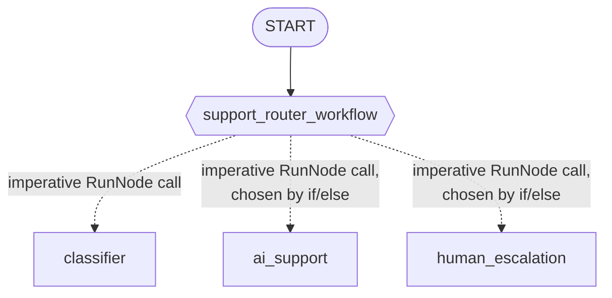

# Module 18: Dynamic Orchestration — Programmable Graphs (Go)

## Theory

### When the Edge List Isn't Enough

Module-16's edges are fixed sequences and fan-outs. Module-17's router dictionary picks one of several fixed destinations by matching a value. Both describe every possible path through the graph up front, as data. Some routing decisions don't fit that shape at all — a decision that needs a loop, a retry, several sequential sub-decisions, or ordinary conditional logic that's easier to write as code than to encode as edges. Dynamic orchestration is the pattern for exactly that: one node whose body *is* Go code, deciding at runtime, in whatever order it wants, which other nodes to run.

### `workflow.NewDynamicNode`: A Node Whose Body Runs Other Nodes

```go
func NewDynamicNode[IN, OUT any](name string, fn DynamicFn[IN, OUT], cfg NodeConfig) Node
```

`DynamicFn[IN, OUT] = func(ctx agent.Context, in IN, emit func(*session.Event) error) (OUT, error)` — an ordinary Go function. Its own doc comment states the idea directly: it "wraps fn as a workflow Node whose execution order is expressed as Go code calling `RunNode` for each child."

### `workflow.RunNode`: Calling Another Node From Inside One

```go
func RunNode[OUT any](ctx agent.Context, child Node, input any, opts ...RunNodeOption) (OUT, error)
```

This is the mechanism that lets a dynamic node's body invoke another node imperatively and get its result back directly, mid-function — confirmed live in this module's probe, and confirmed by reading `workflow/run_node.go`: `RunNode` looks up a sub-scheduler on `ctx` and uses it to run `child`. A `NewDynamicNode` activation is the one context that actually has that sub-scheduler; a plain `FunctionNode`'s or `AgentNode`'s context never does (the exact restriction module-17 ran into, and worked around by making its classifier a separate graph node instead). Here, with a genuine dynamic node, there's no restriction to work around — the classifier is simply invoked directly:

```go
supportRouterWorkflow := workflow.NewDynamicNode("support_router_workflow",
    func(ctx agent.Context, input string, emit func(*session.Event) error) (string, error) {
        classification, err := workflow.RunNode[map[string]any](ctx, classifierNode, input)
        if err != nil {
            return "", err
        }

        chosen := aiSupportNode
        if classification["sentiment"] == "angry" {
            chosen = humanEscalationNode
        }

        return workflow.RunNode[string](ctx, chosen, input)
    },
    workflow.NodeConfig{},
)
```

### A Genuine Gotcha: `RunNode`'s Output Type Is a Plain Assertion, Not a Schema Conversion

`classifier` is built with `llmagent.Config.OutputSchema`, constraining its final answer to `{"sentiment": "angry"|"neutral"|"happy"}`. It's tempting to declare `workflow.RunNode[SentimentClassification](...)` against a matching Go struct — but that fails. Confirmed live: `RunNode`'s implementation does a plain Go type assertion (`rawOut.(OUT)`) on the child node's raw output, with no schema-aware conversion fallback. This is a genuine, confirmed difference from `workflow.NewFunctionNode`'s own input handling (module-17's finding), which *does* convert a predecessor's structured output into a declared struct automatically. `RunNode` doesn't do that — the classifier's structured result arrives as a plain `map[string]any`, and the only call shape that actually works is:

```go
classification, err := workflow.RunNode[map[string]any](ctx, classifierNode, input)
// classification["sentiment"], not a typed field
```

Trying `RunNode[SentimentClassification]` against the same node fails at runtime with `"output type map[string]interface {} does not satisfy expected ... SentimentClassification"` — confirmed by running exactly that call in this module's own probe.

### The Routing Decision Lives in Go Code, Not the Edge List

The whole static graph for this module is one edge:



The dashed arrows aren't graph edges — there's no `workflow.Edge` connecting `support_router_workflow` to any of the three agent nodes. They represent calls the dynamic node's own Go code makes at runtime, in whatever order and under whatever condition the function body decides. Reading the edge list alone would show only the solid arrow; the real routing logic lives entirely inside `support_router_workflow`'s function body.

### `RerunOnResume`: Already the Right Default

`workflow.NodeConfig.RerunOnResume *bool` controls what happens if a dynamic node's execution is interrupted (for example, mid-way through a human-in-the-loop pause) and later resumed: `&true` re-runs the orchestrator function from scratch, letting cached `RunNode` results replay without re-calling the underlying agents; `&false` instead hands the resume payload directly to whatever node runs next. Confirmed by reading `NewDynamicNode`'s own defaulting logic: a bare `workflow.NodeConfig{}` already gets `RerunOnResume` set to `&true` automatically — the re-entry behavior a dynamic orchestrator generally needs is already the default, with no extra configuration required to get it.

### Key Takeaways
- `workflow.NewDynamicNode` wraps an ordinary Go function as a node whose execution order — including which other nodes it runs, in what order, under what condition — is expressed directly in that function's own code.
- `workflow.RunNode`, called from inside a dynamic node's body, runs another node and returns its output directly — genuinely usable here, unlike inside a plain `FunctionNode`.
- `RunNode`'s output type is a plain type assertion with no schema-aware conversion — a node built with `OutputSchema` still needs to be called as `RunNode[map[string]any]`, indexed by key.
- A dynamic node's real routing logic can be invisible in the edge list — document it accordingly, since a diagram of the static edges alone would understate what the node actually does.
- `RerunOnResume` already defaults to `&true` for a `NewDynamicNode` — the resumability behavior a dynamic orchestrator needs doesn't require explicit configuration.

<hr/>

> **Coming from Python?** Python's `@node(rerun_on_resume=True)` decorator and `ctx.run_node(...)` map almost directly onto Go's `workflow.NewDynamicNode`/`workflow.RunNode` — this is the one orchestration style in this course so far where the two languages' mechanisms line up closely, rather than requiring a structurally different design the way module-17's routing did. One genuine parity worth noting explicitly: Python's own lab.md warns that `ctx.run_node()` returns a plain dict at runtime even when the called node's `output_schema` is a Pydantic model — "access fields with `result["sentiment"]`, not `result.sentiment`." Go's `workflow.RunNode` behaves the same way, for the same reason: neither language's `run_node`/`RunNode` performs schema-aware conversion on the child's output.
