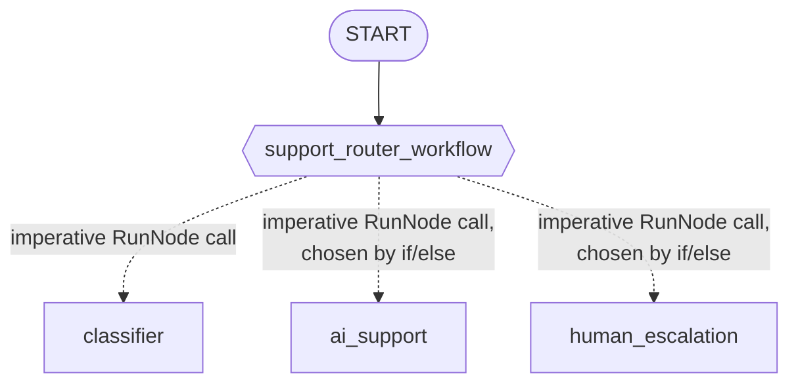

# Laboratorio 18: Construyendo un Enrutador de Soporte Inteligente (Go) 🎧

## Objetivo

Construyamos un grafo de orquestación dinámica: un nodo clasifica el sentimiento de una solicitud, luego un `if`/`else` de Go simple — no un edge declarado — la enruta hacia soporte con IA o escalación humana. 🚀

### La Arquitectura



Las flechas punteadas son llamadas que el propio código Go del nodo dinámico hace en tiempo de ejecución, no edges declarados del grafo — todo el grafo estático es la única flecha sólida desde `START`.

### Paso 1: El Schema, Sin un Struct Que Haga Match Esta Vez

`internal/agents/supportrouter/agent.go` restringe la respuesta del clasificador con un schema, pero — a diferencia del `MarketRoute` del módulo 17 — no declara ningún struct de Go que haga match. `workflow.RunNode` no tiene conversión consciente de schema, así que aquí no hay nada en lo que un struct tipado pueda ayudar:

```go
var sentimentSchema = &genai.Schema{
    Type: genai.TypeObject,
    Properties: map[string]*genai.Schema{
        "sentiment": {Type: genai.TypeString, Enum: []string{"angry", "neutral", "happy"}},
    },
    Required: []string{"sentiment"},
}
```

### Paso 2: Los Tres Agentes 🧑‍🤝‍🧑

```go
classifier, _ := llmagent.New(llmagent.Config{
    Name:         "classifier",
    Instruction:  classifierInstruction,
    OutputSchema: sentimentSchema,
})
aiSupport, _ := llmagent.New(llmagent.Config{Name: "ai_support", Instruction: aiSupportInstruction})
humanEscalation, _ := llmagent.New(llmagent.Config{Name: "human_escalation", Instruction: humanEscalationInstruction})
```

### Paso 3: El Orquestador Dinámico 🎛️

```go
classifierNode, _ := workflow.NewAgentNode(classifier, workflow.NodeConfig{})
aiSupportNode, _ := workflow.NewAgentNode(aiSupport, workflow.NodeConfig{})
humanEscalationNode, _ := workflow.NewAgentNode(humanEscalation, workflow.NodeConfig{})

supportRouterWorkflow := workflow.NewDynamicNode("support_router_workflow",
    func(ctx agent.Context, input string, emit func(*session.Event) error) (string, error) {
        classification, err := workflow.RunNode[map[string]any](ctx, classifierNode, input)
        if err != nil {
            return "", err
        }

        chosen := aiSupportNode
        if classification["sentiment"] == "angry" {
            chosen = humanEscalationNode
        }

        return workflow.RunNode[string](ctx, chosen, input)
    },
    workflow.NodeConfig{},
)
```

Dos cosas que vale la pena notar aquí: `classification["sentiment"]` se lee de un map simple, no de un campo de struct — probar un struct tipado falla en tiempo de ejecución, confirmado en vivo. Y el `if`/`else` que elige `chosen` es simplemente Go ordinario — sin diccionario, sin `Route`, sin edge. Refrescantemente simple. 😌

### Paso 4: Arma el Grafo 🧩

```go
edges := []workflow.Edge{
    {From: workflow.Start, To: supportRouterWorkflow},
}

rootAgent, _ := workflowagent.New(workflowagent.Config{Name: "SupportSystem", Edges: edges})
```

Un solo edge — toda la decisión de enrutamiento vive dentro del propio cuerpo de la función de `support_router_workflow`.

### Paso 5: Corre y Verifica ▶️

```bash
go run ./cmd/support-router console
```

Salida real y confirmada de este comando exacto (backend Gemini):

```
🎧 support-router using gemini-3.5-flash

User -> THIS IS DISGUSTING! I WANT TO CANCEL EVERYTHING!
Agent -> {"sentiment":"angry"}Human Escalation:

I am very sorry for the experience that has caused this level of frustration. I understand
your anger, and I want to reassure you that a senior specialist will be reaching out to you
personally to address your concerns and handle your account cancellation request directly.
```

Prueba con un mensaje claramente positivo (p. ej. "Thanks so much, you've been really helpful!") y confirma que aparece el marcador `"AI Support:"` de `ai_support` en su lugar. 🙂

### Paso 6: Un Test Real y Confirmado 🧪

El test en vivo de `agent_test.go` maneja un mensaje inequívocamente enojado y uno inequívocamente feliz a través del grafo real, verificando que el texto marcador del especialista *correcto* esté presente y el del otro esté ausente — el mismo patrón de lista de marcadores fijos y tabla de casos que reforzó la Fase 6 del propio módulo 17:

```go
allMarkers := []string{"AI Support:", "Human Escalation:"}

cases := []struct {
    message    string
    wantMarker string
}{
    {message: "THIS IS DISGUSTING! I WANT TO CANCEL EVERYTHING!", wantMarker: "Human Escalation:"},
    {message: "Thanks so much, you have been really helpful today!", wantMarker: "AI Support:"},
}
```

Un mensaje límite ("My internet is down, help!") se probó durante el propio probe de este módulo y ambos backends lo clasificaron mal como enojado — una observación real y confirmada de calidad del modelo, no un defecto de código. Los mensajes de test de este laboratorio se mantienen inequívocos a propósito. 👍

### Solución de Problemas 🛠️

Revisa [troubleshooting.md](./troubleshooting.md) si algún paso no se comporta como esperas.

### Resumen del Laboratorio 🎉

Construiste un grafo real de orquestación dinámica: un solo `workflow.NewDynamicNode` cuyo cuerpo llama a `workflow.RunNode` dos veces, con un `if`/`else` ordinario de Go decidiendo qué especialista corre — probado en vivo, con un test que verifica *cuál* especialista realmente respondió para dos sentimientos distintos e inequívocos. ¡Gran trabajo!

### Preguntas de Autorreflexión 🤔
- `workflow.RunNode[map[string]any]` funciona contra el clasificador, pero `workflow.RunNode[SentimentClassification]` (un struct tipado) no. ¿Por qué no, y qué necesitarías hacer distinto si quisieras un resultado tipado?
- `classify_and_route` del módulo 17 no podía llamar al clasificador desde dentro de su propio handler; el `support_router_workflow` de este módulo sí puede. ¿Cuál es la única diferencia en cómo se construye cada tipo de nodo que explica esto?
- ¿Cómo extenderías `support_router_workflow` para probar primero con `ai_support` y solo escalar a un humano si la propia respuesta de la IA indica que no pudo ayudar? ¿Cómo se vería eso como código Go, y podrías expresar lo mismo como edges estáticos o de diccionario?

<hr/>

> **¿Vienes de Python?** 🐍 El laboratorio de Python envuelve `support_router_workflow` como una función async `@node(rerun_on_resume=True)` llamando a `await ctx.run_node(classifier, node_input)`, luego un `if`/`else`, luego `await ctx.run_node(chosen_agent, node_input)`. El `workflow.NewDynamicNode`/`workflow.RunNode` de este laboratorio de Go mapean casi directo a eso — incluyendo la propia advertencia del lab.md de Python de que `ctx.run_node()` devuelve un dict simple en tiempo de ejecución incluso para un nodo con schema Pydantic ("accede a los campos con `result["sentiment"]`, no `result.sentiment"`), que es exactamente por qué este laboratorio lee `classification["sentiment"]` de un `map[string]any` en vez de un struct tipado.
