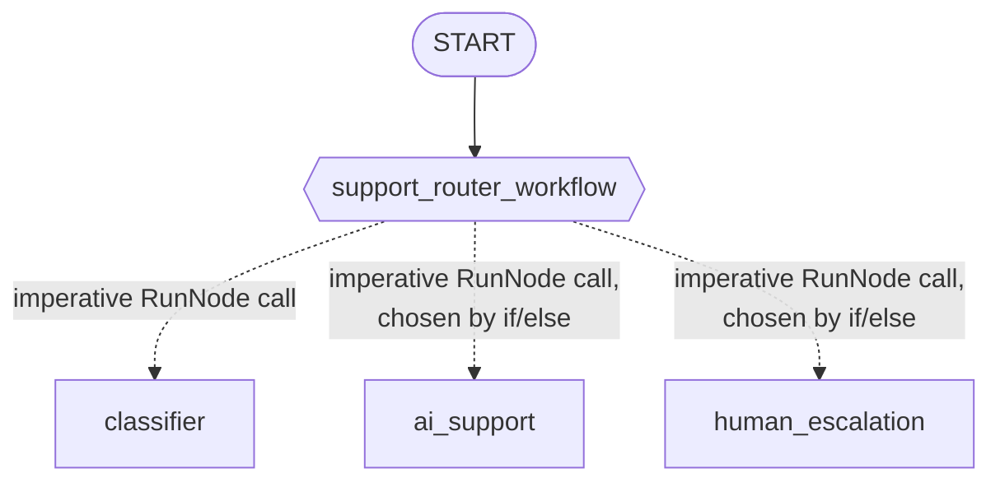

# Lab 18: Building a Smart Support Router (Go) 🎧

## Goal

Let's build a dynamic-orchestration graph: one node classifies a request's sentiment, then plain Go `if`/`else` — not a declared edge — routes it to AI support or human escalation. 🚀

### The Architecture



The dashed arrows are calls the dynamic node's own Go code makes at runtime, not declared graph edges — the whole static graph is the single solid arrow from `START`.

### Step 1: The Schema, With No Matching Struct This Time

`internal/agents/supportrouter/agent.go` constrains the classifier's response with a schema, but — unlike module-17's `MarketRoute` — declares no matching Go struct. `workflow.RunNode` has no schema-aware conversion, so there's nothing for a typed struct to help with here:

```go
var sentimentSchema = &genai.Schema{
    Type: genai.TypeObject,
    Properties: map[string]*genai.Schema{
        "sentiment": {Type: genai.TypeString, Enum: []string{"angry", "neutral", "happy"}},
    },
    Required: []string{"sentiment"},
}
```

### Step 2: The Three Agents 🧑‍🤝‍🧑

```go
classifier, _ := llmagent.New(llmagent.Config{
    Name:         "classifier",
    Instruction:  classifierInstruction,
    OutputSchema: sentimentSchema,
})
aiSupport, _ := llmagent.New(llmagent.Config{Name: "ai_support", Instruction: aiSupportInstruction})
humanEscalation, _ := llmagent.New(llmagent.Config{Name: "human_escalation", Instruction: humanEscalationInstruction})
```

### Step 3: The Dynamic Orchestrator 🎛️

```go
classifierNode, _ := workflow.NewAgentNode(classifier, workflow.NodeConfig{})
aiSupportNode, _ := workflow.NewAgentNode(aiSupport, workflow.NodeConfig{})
humanEscalationNode, _ := workflow.NewAgentNode(humanEscalation, workflow.NodeConfig{})

supportRouterWorkflow := workflow.NewDynamicNode("support_router_workflow",
    func(ctx agent.Context, input string, emit func(*session.Event) error) (string, error) {
        classification, err := workflow.RunNode[map[string]any](ctx, classifierNode, input)
        if err != nil {
            return "", err
        }

        chosen := aiSupportNode
        if classification["sentiment"] == "angry" {
            chosen = humanEscalationNode
        }

        return workflow.RunNode[string](ctx, chosen, input)
    },
    workflow.NodeConfig{},
)
```

Two things worth noticing here: `classification["sentiment"]` is read from a plain map, not a struct field — trying a typed struct fails at runtime, confirmed live. And the `if`/`else` choosing `chosen` is just ordinary Go — no dictionary, no `Route`, no edge. Refreshingly simple. 😌

### Step 4: Assemble the Graph 🧩

```go
edges := []workflow.Edge{
    {From: workflow.Start, To: supportRouterWorkflow},
}

rootAgent, _ := workflowagent.New(workflowagent.Config{Name: "SupportSystem", Edges: edges})
```

One edge — the entire routing decision lives inside `support_router_workflow`'s own function body.

### Step 5: Run and Verify ▶️

```bash
go run ./cmd/support-router console
```

Real, confirmed output from this exact command (Gemini backend):

```
🎧 support-router using gemini-3.5-flash

User -> THIS IS DISGUSTING! I WANT TO CANCEL EVERYTHING!
Agent -> {"sentiment":"angry"}Human Escalation:

I am very sorry for the experience that has caused this level of frustration. I understand
your anger, and I want to reassure you that a senior specialist will be reaching out to you
personally to address your concerns and handle your account cancellation request directly.
```

Try a clearly positive message (e.g. "Thanks so much, you've been really helpful!") and confirm `ai_support`'s `"AI Support:"` marker appears instead. 🙂

### Step 6: A Real, Confirmed Test 🧪

`agent_test.go`'s live test drives an unambiguously angry message and an unambiguously happy message through the real graph, checking the *correct* specialist's marker text is present and the other's is absent — the same table-driven, fixed-marker-list pattern module-17's own Phase 6 simplification hardened:

```go
allMarkers := []string{"AI Support:", "Human Escalation:"}

cases := []struct {
    message    string
    wantMarker string
}{
    {message: "THIS IS DISGUSTING! I WANT TO CANCEL EVERYTHING!", wantMarker: "Human Escalation:"},
    {message: "Thanks so much, you have been really helpful today!", wantMarker: "AI Support:"},
}
```

A borderline message ("My internet is down, help!") was tried during this module's own probe and got misclassified as angry by both backends — a real, confirmed model-quality observation, not a code defect. This lab's test messages stay unambiguous on purpose. 👍

### Troubleshooting 🛠️

See [troubleshooting.md](./troubleshooting.md) if a step doesn't behave as expected.

### Lab Summary 🎉

You built a real dynamic-orchestration graph: a single `workflow.NewDynamicNode` whose body calls `workflow.RunNode` twice, with an ordinary Go `if`/`else` deciding which specialist runs — proven live, with a test that checks *which* specialist actually answered for two distinct, unambiguous sentiments. Great work!

### Self-Reflection Questions 🤔
- `workflow.RunNode[map[string]any]` works against the classifier, but `workflow.RunNode[SentimentClassification]` (a typed struct) does not. Why not, and what would you need to do differently if you wanted a typed result?
- Module-17's `classify_and_route` couldn't call the classifier from inside its own handler; this module's `support_router_workflow` can. What's the one difference in how each node type is constructed that explains this?
- How would you extend `support_router_workflow` to try `ai_support` first and only escalate to a human if the AI's own response indicates it couldn't help? What would that look like as Go code, and could you express the same thing as static or dictionary edges?

<hr/>

> **Coming from Python?** 🐍 Python's lab wraps `support_router_workflow` as an `@node(rerun_on_resume=True)` async function calling `await ctx.run_node(classifier, node_input)`, then an `if`/`else`, then `await ctx.run_node(chosen_agent, node_input)`. This Go lab's `workflow.NewDynamicNode`/`workflow.RunNode` map onto that almost directly — including Python's own lab.md warning that `ctx.run_node()` returns a plain dict at runtime even for a Pydantic-schema'd node ("access fields with `result["sentiment"]`, not `result.sentiment"`), which is exactly why this lab reads `classification["sentiment"]` from a `map[string]any` rather than a typed struct.
