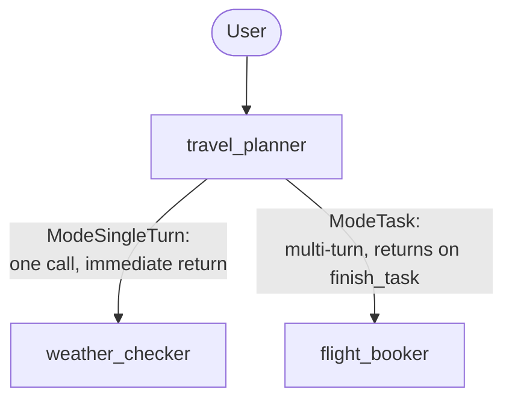

# Módulo 19: Equipos Colaborativos — Modos y Traspasos (Go) 🤝

## Teoría

### Delegación con un Camino de Vuelta Garantizado 🔄

Los módulos 13/15 ya nos mostraron `SubAgents` y `transfer_to_agent`: un coordinador le pasa la conversación a un especialista, y ese especialista se mantiene activo hasta que decide transferir de nuevo. Eso es un traspaso genuino — genial cuando la delegación está pensada para ser definitiva, como enrutar una solicitud de soporte al equipo correcto. Pero algunas delegaciones no están pensadas para ser definitivas en absoluto: un coordinador que necesita la respuesta de un especialista, luego la de otro, y quiere combinar ambas, necesita que cada especialista *termine* y devuelva el control automáticamente — sin que tú escribas código de orquestación, y sin confiar en que el propio juicio del especialista recuerde transferir de vuelta.

### `llmagent.Config.Mode`: Tres Formas en Que un Sub-Agente Puede Comportarse 🎭

```go
type Mode = llminternal.Mode

const (
    ModeChat       Mode = ... // reachable via transfer_to_agent; no automatic return
    ModeTask       Mode = ... // chats with the user to accomplish a task, then returns automatically
    ModeSingleTurn Mode = ... // one reasoning step, then returns immediately
)
```

- **`ModeChat`** (el default para un sub-agente) — un traspaso real, exactamente como el propio patrón de los módulos 13/15.
- **`ModeSingleTurn`** — sin interacción con el usuario; el sub-agente produce una respuesta y el control vuelve al coordinador de inmediato, en el mismo turno.
- **`ModeTask`** — el sub-agente puede conversar con el usuario durante tantos turnos como necesite, y devuelve el control automáticamente en el momento en que llama a la herramienta `finish_task` inyectada por el framework — incluso a mitad de conversación, dentro de ese mismo turno.

```go
weatherChecker, _ := llmagent.New(llmagent.Config{
    Name:        "weather_checker",
    Mode:        llmagent.ModeSingleTurn,
    Instruction: weatherInstruction,
})
flightBooker, _ := llmagent.New(llmagent.Config{
    Name:        "flight_booker",
    Mode:        llmagent.ModeTask,
    Instruction: flightInstruction,
})
travelPlanner, _ := llmagent.New(llmagent.Config{
    Name:        "travel_planner",
    Instruction: plannerInstruction,
    SubAgents:   []agent.Agent{weatherChecker, flightBooker},
})
```

No hace falta ningún wrapper `Workflow`/`workflowagent` — con `SubAgents` simple más `Mode` configurado alcanza, extendiendo el propio hallazgo del módulo 15 de que la delegación guiada por LLM no necesita un wrapper de orquestación.

### Una Simplificación Confirmada: No Hace Falta Configurar Reanudabilidad 🎁

Un sub-agente en modo task puede pausar a mitad de conversación y reanudar en un turno posterior — el tipo de comportamiento que, en el mundo de nodos dinámicos del módulo 18, necesitaba configurar explícitamente `workflow.NodeConfig.RerunOnResume`. Aquí va la sorpresa agradable: `llmagent.Config` no tiene ningún campo equivalente en ninguna parte, ¡y resulta que no hace falta ninguno! Cada `llmagent` se envuelve internamente como un `workflow.NewDynamicNode` por el runner, que configura `NodeConfig.RerunOnResume` en `true` automáticamente cada vez que el agente envuelto es un `LlmAgent` (confirmado leyendo el `newAgentNode` de `runner/agent_node.go`). El framework simplemente lo maneja por ti, en vez de que no haya nada que configurar. Probado en vivo (`temp/module-19/probe/main.go`): una conversación real de dos turnos — `flight_booker` haciendo una pregunta aclaratoria en el turno uno, y luego terminando y devolviendo el control automáticamente a `travel_planner` en el turno dos — funcionó correctamente con cero configuración de reanudabilidad en cualquiera de los tres agentes. ¡Genial! ✅

### Una Diferencia de Nombres Confirmada: La Herramienta Inyectada Es Justo el Nombre del Agente 🏷️

Un sub-agente en `ModeTask`/`ModeSingleTurn` se expone a su padre como una herramienta invocable. Confirmado leyendo directamente `internal/workflowinternal/task_agent_tool.go` y `single_turn_tool.go`: el nombre de esa herramienta es el propio nombre del sub-agente (`t.agent.Name()`) — un sub-agente llamado `flight_booker` se convierte en una herramienta literalmente llamada `flight_booker`, no un nombre compuesto armado a partir de un prefijo y el nombre del agente.

### `finish_task`: Cómo un Agente en Modo Task Señala que Terminó ✋

`internal/workflowinternal/finish_task_tool.go` confirma que el framework inyecta automáticamente una herramienta llamada `finish_task` en el conjunto de herramientas de cualquier sub-agente `ModeTask`. El modelo la llama cuando tiene todo lo que necesita; llamarla es lo que dispara el retorno automático al padre, dentro de ese mismo turno.

### Despacho Consciente del Modo, No un Segundo Tipo de Transferencia 🔀

Los sub-agentes `ModeTask`/`ModeSingleTurn` no participan en `transfer_to_agent` en absoluto — confirmado leyendo `internal/llminternal/agent_transfer.go`: un comentario del código fuente dice claramente que "task & single_turn agents are handled by llmagent wrapper code," y `isUntransferableMode` excluye explícitamente ambos modos de los destinos de traspaso ordinarios que usaría un sub-agente `ModeChat`. Delegar a un sub-agente task/single-turn es un despacho por llamada de función (a través de `TaskAgentTool`/`SingleTurnTool`), no un traspaso — el agente que llama se mantiene como el que produce la salida visible de la conversación, usando el resultado del sub-agente como datos.

### Una Consecuencia Genuina y Confirmada: A Dónde Va Realmente el Texto del Sub-Agente 🕵️

Porque el despacho task/single-turn es una llamada de función, no un traspaso, la respuesta de un sub-agente no necesariamente aparece como su propio turno separadamente autorado. Confirmado en vivo este módulo: la pregunta aclaratoria de `flight_booker` llegó plegada directamente dentro de la propia respuesta hacia afuera de `travel_planner` en el mismo turno — la propia llamada al modelo del coordinador incorporó el resultado de la herramienta y se lo dijo al usuario ella misma. Esto importa para cualquier cosa que inspeccione el flujo de eventos programáticamente (un test, un visor de trazas): no asumas que la salida de un sub-agente en modo task es el evento "final" separadamente autorado del turno — revisa el contenido visible real en su lugar.

### La Forma del Equipo



### `AgentTool`: La Otra Forma de Componer Agentes 🧰

`tool/agenttool.New(agent agent.Agent, cfg *Config) tool.Tool` envuelve cualquier agente como una entrada simple en una lista `Tools` — confirmado real y presente en el SDK fijado, sin ninguna advertencia en su propio comentario de documentación del paquete contra usarlo en un agente local. El patrón ya establecido de este curso todavía favorece `Mode` para composición local, siguiendo este laboratorio, pero `agenttool.New` es una alternativa real y disponible que vale la pena conocer.

### Componiendo Agentes Remotos: `agent/remoteagent/v2` 🌍

Para componer agentes que corren como servicios separados en vez de sub-agentes locales, `google.golang.org/adk/v2/agent/remoteagent/v2` provee `NewA2A(cfg A2AConfig) (agent.Agent, error)` — confirmado real y presente en el SDK fijado, respaldado por las bibliotecas cliente/servidor de `a2aproject/a2a-go` y un paquete del lado del servidor que hace match (`server/adka2a/v2`). `A2AConfig` toma un `Name`/`Description` y ya sea un `AgentCard` estático o un `AgentCardProvider` que resuelve uno por invocación:

```go
remoteAgent, _ := remoteagentv2.NewA2A(remoteagentv2.A2AConfig{
    Name:              "preferences_specialist",
    AgentCardProvider: remoteagentv2.NewAgentCardProvider("https://preferences-service.example.com/a2a/agent-card.json"),
})
```

El paquete `agent/remoteagent` más viejo (sin el sufijo `/v2`) todavía existe, pero su propio comentario de documentación lo marca como deprecado a favor de `remoteagent/v2`. Cablear un agente remoto real de esta forma es un esfuerzo más grande que la composición local con `Mode`/`agenttool` — necesita un servicio corriendo por separado y un round-trip A2A real — que es por qué el propio equipo de este laboratorio se mantiene totalmente local; `remoteagent/v2` se menciona aquí como el constructo real al que recurrir una vez que eso sea genuinamente necesario, no como algo que se construye como parte de este laboratorio.

### Puntos Clave ✅
- `llmagent.Config.Mode` (`ModeChat`/`ModeTask`/`ModeSingleTurn`) controla si un sub-agente hace un traspaso permanente, vuelve después de un paso, o conversa a través de varios turnos y vuelve automáticamente en `finish_task`.
- No hace falta configurar reanudabilidad en ninguna parte de `llmagent.Config` — el runner configura el equivalente `workflow.NodeConfig.RerunOnResume` automáticamente para cada nodo `LlmAgent`, confirmado leyendo `runner/agent_node.go`.
- La herramienta inyectada de un sub-agente task/single-turn tiene el nombre del propio agente, y se despacha como una llamada de función, no un traspaso — su salida puede terminar plegada dentro de la propia respuesta del agente que llama en vez de aparecer como su propio turno separadamente autorado.
- `tool/agenttool.New` es una alternativa real y disponible a `Mode` para composición local de agentes.
- `agent/remoteagent/v2.NewA2A` es el constructo real para componer agentes que corren como servicios separados — más pesado de configurar que la composición local, pero genuinamente disponible en este SDK fijado.

<hr/>

> **¿Vienes de Python?** 🐍 `mode="task"`/`mode="single_turn"` de Python mapean directo a `llmagent.ModeTask`/`ModeSingleTurn` de Go, y `finish_task` es el mismo nombre en ambos. Dos diferencias reales que vale la pena conocer: el laboratorio de Python requiere `rerun_on_resume=True` en cada agente de la cadena de despacho o lanza un `ValueError`; el `llmagent.Config` de Go no tiene tal campo y no necesita ninguno, confirmado en vivo. Y el README de Python describe la herramienta inyectada como `request_task_<agent_name>`; Go la nombra simplemente `<agent_name>`, confirmado leyendo los constructores reales de herramientas. El `RemoteA2aAgent` de Python mapea al `agent/remoteagent/v2.NewA2A` de Go — ambos envuelven un servicio de agente corriendo por separado detrás de las mismas interfaces locales `agent.Agent`/`tool.Tool` que usa el resto del framework. El propio docstring de `AgentTool` de Python desaconseja envolver un agente *local* con él y recomienda `mode="single_turn"` en su lugar; el comentario de documentación del paquete `agenttool` de Go no trae ninguna advertencia equivalente, aunque este curso todavía favorece `Mode` para composición local de todas formas.
