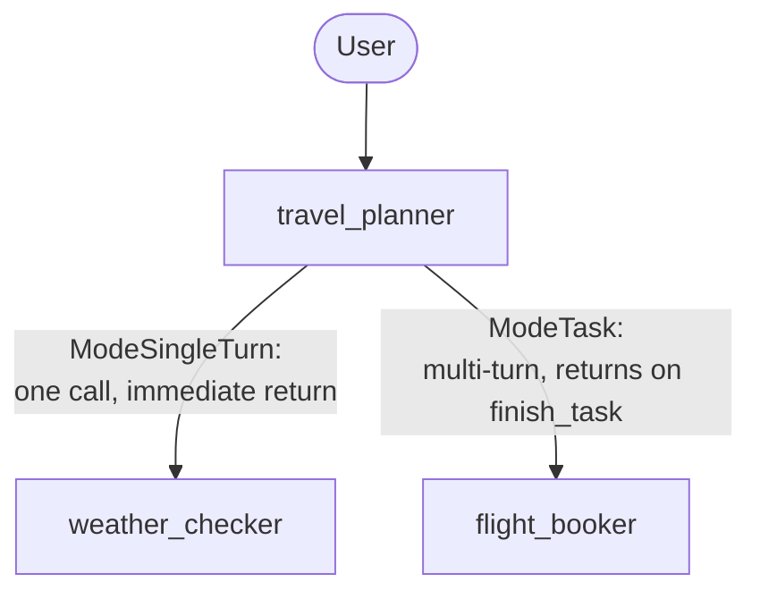

# Module 19: Collaborative Teams — Modes and Hand-offs (Go)

## Theory

### Delegation With a Guaranteed Way Back

Module-13/15 already established `SubAgents` and `transfer_to_agent`: a coordinator hands the conversation to a specialist, and that specialist stays active until it decides to transfer again. That's a genuine hand-off — useful when delegation is meant to be final, like routing a support request to the right team. Some delegation isn't meant to be final at all: a coordinator that needs one specialist's answer, then another's, then wants to combine both, needs each specialist to *finish* and hand control back automatically — without writing orchestration code, and without trusting the specialist's own judgment to remember to transfer back.

### `llmagent.Config.Mode`: Three Ways a Sub-Agent Can Behave

```go
type Mode = llminternal.Mode

const (
    ModeChat       Mode = ... // reachable via transfer_to_agent; no automatic return
    ModeTask       Mode = ... // chats with the user to accomplish a task, then returns automatically
    ModeSingleTurn Mode = ... // one reasoning step, then returns immediately
)
```

- **`ModeChat`** (the default for a sub-agent) — a real hand-off, exactly like module-13/15's own pattern.
- **`ModeSingleTurn`** — no user interaction; the sub-agent produces one response and control returns to the coordinator immediately, same turn.
- **`ModeTask`** — the sub-agent can converse with the user across as many turns as it needs, and returns control automatically the moment it calls the framework-injected `finish_task` tool — even mid-conversation, within that same turn.

```go
weatherChecker, _ := llmagent.New(llmagent.Config{
    Name:        "weather_checker",
    Mode:        llmagent.ModeSingleTurn,
    Instruction: weatherInstruction,
})
flightBooker, _ := llmagent.New(llmagent.Config{
    Name:        "flight_booker",
    Mode:        llmagent.ModeTask,
    Instruction: flightInstruction,
})
travelPlanner, _ := llmagent.New(llmagent.Config{
    Name:        "travel_planner",
    Instruction: plannerInstruction,
    SubAgents:   []agent.Agent{weatherChecker, flightBooker},
})
```

No `Workflow`/`workflowagent` wrapper is involved — plain `SubAgents` with `Mode` set is enough, extending module-15's own finding that LLM-driven delegation needs no orchestration wrapper.

### A Confirmed Simplification: No Resumability Configuration Needed

A task-mode sub-agent can pause mid-conversation and resume on a later turn — the kind of behavior that, in module-18's dynamic-node world, needed `workflow.NodeConfig.RerunOnResume` set explicitly. `llmagent.Config` has no equivalent field anywhere on it, and it turns out none is needed: every `llmagent` is internally wrapped as a `workflow.NewDynamicNode` by the runner, which sets `NodeConfig.RerunOnResume` to `true` automatically whenever the wrapped agent is an `LlmAgent` (confirmed by reading `runner/agent_node.go`'s `newAgentNode`). The framework handles it for you, rather than there simply being nothing to configure. Proven live (`temp/module-19/probe/main.go`): a real two-turn conversation — `flight_booker` asking a clarifying question on turn one, then finishing and automatically handing control back to `travel_planner` on turn two — worked correctly with zero resumability configuration on any of the three agents.

### A Confirmed Naming Difference: The Injected Tool Is Just the Agent's Own Name

A `ModeTask`/`ModeSingleTurn` sub-agent is exposed to its parent as a callable tool. Confirmed by reading `internal/workflowinternal/task_agent_tool.go` and `single_turn_tool.go` directly: that tool's name is the sub-agent's own name (`t.agent.Name()`) — a sub-agent named `flight_booker` becomes a tool literally called `flight_booker`, not a compound name built from a prefix and the agent's name.

### `finish_task`: How a Task-Mode Agent Signals Completion

`internal/workflowinternal/finish_task_tool.go` confirms the framework auto-injects a tool named `finish_task` into any `ModeTask` sub-agent's own toolset. The model calls it when it has everything it needs; calling it is what triggers the automatic return to the parent, within that same turn.

### Mode-Aware Dispatch, Not a Second Kind of Transfer

`ModeTask`/`ModeSingleTurn` sub-agents don't participate in `transfer_to_agent` at all — confirmed by reading `internal/llminternal/agent_transfer.go`: a source comment states plainly that "task & single_turn agents are handled by llmagent wrapper code," and `isUntransferableMode` explicitly excludes both modes from the ordinary hand-off targets a `ModeChat` sub-agent would use. Delegating to a task/single-turn sub-agent is a function-call dispatch (through `TaskAgentTool`/`SingleTurnTool`), not a hand-off — the calling agent stays the one producing the conversation's visible output, using the sub-agent's result as data.

### A Genuine, Confirmed Consequence: Where the Sub-Agent's Text Actually Ends Up

Because task/single-turn dispatch is a function call, not a hand-off, a sub-agent's response doesn't necessarily show up as its own, separately-authored turn. Confirmed live this module: `flight_booker`'s clarifying question arrived folded directly into `travel_planner`'s own outward-facing response in the same turn — the coordinator's own model call incorporated the tool result and spoke it to the user itself. This matters for anything inspecting the event stream programmatically (a test, a trace viewer): don't assume a task-mode sub-agent's own output is the turn's distinctly-authored "final" event — check the actual visible content instead.

### The Team's Shape



### `AgentTool`: The Other Way to Compose Agents

`tool/agenttool.New(agent agent.Agent, cfg *Config) tool.Tool` wraps any agent as a plain entry in a `Tools` list — confirmed real and present in the pinned SDK, with no warning in its own package doc comment against using it on a local agent. This course's own established pattern still favors `Mode` for local composition, matching this lab, but `agenttool.New` is a real, available alternative worth knowing about.

### Composing Remote Agents: `agent/remoteagent/v2`

For composing agents running as separate services rather than local sub-agents, `google.golang.org/adk/v2/agent/remoteagent/v2` provides `NewA2A(cfg A2AConfig) (agent.Agent, error)` — confirmed real and present in the pinned SDK, backed by the `a2aproject/a2a-go` client/server libraries and a matching server-side package (`server/adka2a/v2`). `A2AConfig` takes a `Name`/`Description` and either a static `AgentCard` or an `AgentCardProvider` that resolves one per invocation:

```go
remoteAgent, _ := remoteagentv2.NewA2A(remoteagentv2.A2AConfig{
    Name:              "preferences_specialist",
    AgentCardProvider: remoteagentv2.NewAgentCardProvider("https://preferences-service.example.com/a2a/agent-card.json"),
})
```

The older `agent/remoteagent` package (without the `/v2` suffix) still exists but its own doc comment marks it deprecated in favor of `remoteagent/v2`. Wiring a real remote agent this way is a heavier lift than local `Mode`/`agenttool` composition — it needs a separate running service and an actual A2A round-trip — which is why this lab's own team stays entirely local; `remoteagent/v2` is mentioned here as the real construct to reach for once that's genuinely needed, not built as part of this lab.

### Key Takeaways
- `llmagent.Config.Mode` (`ModeChat`/`ModeTask`/`ModeSingleTurn`) controls whether a sub-agent hands off permanently, returns after one step, or converses across turns and returns automatically on `finish_task`.
- No resumability configuration is needed anywhere on `llmagent.Config` — the runner sets the equivalent `workflow.NodeConfig.RerunOnResume` automatically for every `LlmAgent` node, confirmed by reading `runner/agent_node.go`.
- A task/single-turn sub-agent's injected tool is named after the agent itself, and it's dispatched as a function call, not a hand-off — its output can end up folded into the calling agent's own response rather than appearing as its own distinctly-authored turn.
- `tool/agenttool.New` is a real, available alternative to `Mode` for local agent composition.
- `agent/remoteagent/v2.NewA2A` is the real construct for composing agents running as separate services — heavier to set up than local composition, but genuinely available in this pinned SDK.

<hr/>

> **Coming from Python?** Python's `mode="task"`/`mode="single_turn"` map directly onto Go's `llmagent.ModeTask`/`ModeSingleTurn`, and `finish_task` is the same name in both. Two real differences worth knowing: Python's lab requires `rerun_on_resume=True` on every agent in the dispatch chain or raises a `ValueError`; Go's `llmagent.Config` has no such field and needs none, confirmed live. And Python's README describes the injected tool as `request_task_<agent_name>`; Go names it just `<agent_name>`, confirmed by reading the actual tool constructors. Python's `RemoteA2aAgent` maps onto Go's `agent/remoteagent/v2.NewA2A` — both wrap a separately-running agent service behind the same local `agent.Agent`/`tool.Tool` interfaces the rest of the framework uses. Python's own `AgentTool` docstring discourages wrapping a *local* agent with it and recommends `mode="single_turn"` instead; Go's `agenttool` package doc carries no equivalent warning, though this course still favors `Mode` for local composition either way.
