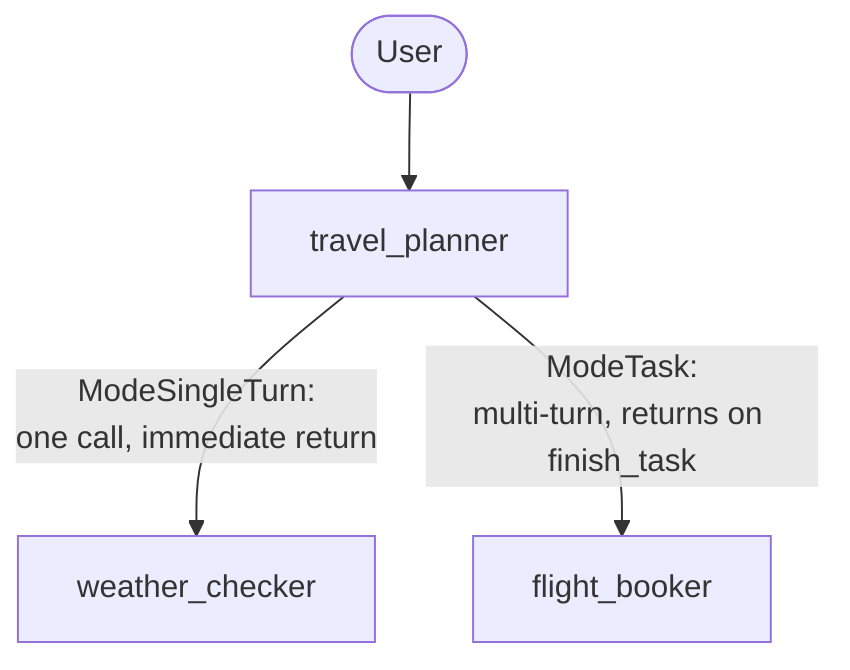

# Laboratorio 19: Construyendo un Equipo de Viajes Colaborativo (Go) ✈️

## Objetivo

Construyamos un Equipo de Planificación de Viajes: un coordinador delega a un especialista en clima (`single_turn`) y a un reservador de vuelos (`task`, permitiendo ida y vuelta sobre preferencias), luego presenta un plan combinado. 🧳

### La Forma del Equipo



### Paso 1: El Especialista en Clima — `ModeSingleTurn` ☀️

```go
weatherChecker, _ := llmagent.New(llmagent.Config{
    Name:        "weather_checker",
    Instruction: weatherInstruction, // "Provide a brief 3-day forecast..."
    Mode:        llmagent.ModeSingleTurn,
})
```

Una llamada, sin ida y vuelta, retorno inmediato al coordinador.

### Paso 2: El Reservador de Vuelos — `ModeTask` ✈️

```go
flightBooker, _ := llmagent.New(llmagent.Config{
    Name:        "flight_booker",
    Instruction: flightInstruction, // "...ask exactly one clarifying question if needed..."
    Mode:        llmagent.ModeTask,
})
```

`flight_booker` puede hacerle una pregunta al usuario y esperar la respuesta a través de tantos turnos como necesite — el framework devuelve el control al coordinador automáticamente en el momento en que el modelo llama a la herramienta inyectada `finish_task`, no antes.

### Paso 3: El Coordinador — Sin Necesitar `Mode` 🧭

```go
travelPlanner, _ := llmagent.New(llmagent.Config{
    Name:        "travel_planner",
    Instruction: plannerInstruction, // "Get weather, then book a flight, then present the plan"
    SubAgents:   []agent.Agent{weatherChecker, flightBooker},
})
```

Sin campo `Mode` configurado — el coordinador es la raíz, alcanzable directamente por el usuario, no un sub-agente al que se le delega.

### Paso 4: Corre y Prueba 🚀

```bash
go run ./cmd/travel-planner console
```

Salida real y confirmada de este comando exacto (backend Gemini, dos turnos reales):

```
User -> I want to go to Tokyo next week.
Agent -> Here is a quick 3-day weather forecast for Tokyo next week:

*   Day 1: Mostly sunny with a high of 18°C (64°F) and a gentle breeze.
*   Day 2: Cloudy with a 40% chance of light showers in the afternoon, high of 15°C (59°F).
*   Day 3: Clear skies returning, with cooler and crisp temperatures around 13°C (55°F).

Do you have a preferred airline or a preferred time of day for your flight to Tokyo next week?

User -> United, morning flight please.
Agent -> Here is your completed travel plan for your trip to Tokyo next week:

### ✈️ Flight Details
*   Airline: United Airlines
*   Departure: Next Thursday morning at 8:30 AM

### ☀️ Weather Forecast
*   Day 1: Mostly sunny with a high of 18°C (64°F) and a gentle breeze.
*   Day 2: Cloudy with a 40% chance of light showers in the afternoon, high of 15°C (59°F).
*   Day 3: Clear skies returning, with cooler and crisp temperatures around 13°C (55°F).

Have a wonderful trip to Tokyo! Safe travels!
```

Fíjate que no hay ningún momento separado de "traspaso" visible para el usuario — `flight_booker` hizo su pregunta, el usuario respondió en el siguiente turno, y el plan combinado volvió de inmediato, todo sin ningún código de orquestación escrito para este módulo. Fluido. 😌

### Paso 5: Un Test Real y Confirmado — y un Descubrimiento Genuino 🔍

La primera versión del test de este laboratorio aseveraba sobre `event.Author`/`IsFinalResponse()`, esperando que la pregunta aclaratoria de `flight_booker` apareciera como su propio evento separadamente autorado y no final. Esa aserción estaba equivocada — confirmado en vivo: porque el despacho en modo task es una llamada de función, no un traspaso, la pregunta de `flight_booker` llegó plegada directamente dentro de la propia respuesta hacia afuera de `travel_planner` en el mismo turno. El test que funciona en cambio revisa el contenido real y externamente observable:

```go
turn1Text, _ := runTurn(ctx, r, "test_user", "test_session", "I want to go to Tokyo next week.")
// turn1Text should NOT yet mention "united" — the user hasn't said it

turn2Text, _ := runTurn(ctx, r, "test_user", "test_session", "United, morning flight please.")
// turn2Text SHOULD mention "united" — proof flight_booker received the
// answer, finished, and its result reached the coordinator's own synthesis
```

Este es un test más sólido y honesto que aseverar sobre plomería interna de eventos: prueba que el traspaso automático realmente llevó información real hacia adelante, no solo que algún evento se disparó. 💪

### Solución de Problemas 🛠️

Revisa [troubleshooting.md](./troubleshooting.md) si algún paso no se comporta como esperas.

### Resumen del Laboratorio 🎉

Construiste un equipo colaborativo real: `ModeSingleTurn` para una consulta rápida de utilidad, `ModeTask` para una sub-tarea interactiva con retorno automático, y un coordinador sin código de orquestación propio — probado en vivo a través de una conversación real de dos turnos, con un test que verifica que el traspaso automático realmente llevó la nueva información del usuario hacia adelante.

### Preguntas de Autorreflexión 🤔
- ¿Por qué usarías `ModeSingleTurn` en vez de `ModeTask` para una consulta que nunca necesita preguntarle nada al usuario?
- El test de este laboratorio no revisa qué evento específico fue de `travel_planner` vs. de `flight_booker`. ¿Por qué no, y cómo se veía revisar lo incorrecto cuando el primer intento de test de este laboratorio se equivocó?
- ¿Cómo extenderías `travel_planner` con un tercer especialista — digamos, un reservador de hoteles — también en `ModeTask`? ¿Qué cambiaría en `agent.go`, y qué no?

<hr/>

> **¿Vienes de Python?** 🐍 El laboratorio de Python requiere `rerun_on_resume=True` en los tres agentes, advirtiendo que omitirlo en cualquiera lanza un `ValueError`. Este laboratorio de Go no necesita ningún campo equivalente en ninguna parte — confirmado en vivo, la misma conversación de dos turnos (una pregunta, luego un retorno automático con el plan combinado) funciona con cero configuración de reanudabilidad. El README de Python también describe la herramienta inyectada por el framework como `request_task_flight_booker`; el propio testing de este laboratorio confirmó que Go la nombra simplemente `flight_booker` — el propio nombre del agente, nada más.
