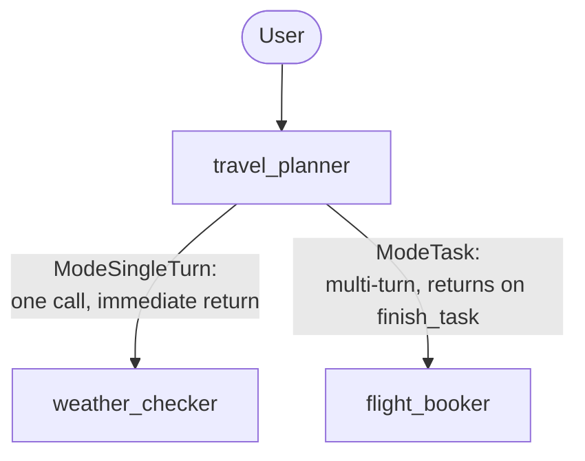

# Lab 19: Building a Collaborative Travel Team (Go) ✈️

## Goal

Let's build a Travel Planning Team: a coordinator delegates to a weather specialist (`single_turn`) and a flight booker (`task`, allowing back-and-forth about preferences), then presents one combined plan. 🧳

### The Team's Shape



### Step 1: The Weather Specialist — `ModeSingleTurn` ☀️

```go
weatherChecker, _ := llmagent.New(llmagent.Config{
    Name:        "weather_checker",
    Instruction: weatherInstruction, // "Provide a brief 3-day forecast..."
    Mode:        llmagent.ModeSingleTurn,
})
```

One call, no back-and-forth, immediate return to the coordinator.

### Step 2: The Flight Booker — `ModeTask` ✈️

```go
flightBooker, _ := llmagent.New(llmagent.Config{
    Name:        "flight_booker",
    Instruction: flightInstruction, // "...ask exactly one clarifying question if needed..."
    Mode:        llmagent.ModeTask,
})
```

`flight_booker` can ask the user a question and wait for the answer across as many turns as it needs — the framework returns control to the coordinator automatically the moment the model calls the injected `finish_task` tool, not before.

### Step 3: The Coordinator — No `Mode` Needed 🧭

```go
travelPlanner, _ := llmagent.New(llmagent.Config{
    Name:        "travel_planner",
    Instruction: plannerInstruction, // "Get weather, then book a flight, then present the plan"
    SubAgents:   []agent.Agent{weatherChecker, flightBooker},
})
```

No `Mode` field set — the coordinator is the root, reachable directly by the user, not a sub-agent being delegated to.

### Step 4: Run and Test 🚀

```bash
go run ./cmd/travel-planner console
```

Real, confirmed output from this exact command (Gemini backend, two real turns):

```
User -> I want to go to Tokyo next week.
Agent -> Here is a quick 3-day weather forecast for Tokyo next week:

*   Day 1: Mostly sunny with a high of 18°C (64°F) and a gentle breeze.
*   Day 2: Cloudy with a 40% chance of light showers in the afternoon, high of 15°C (59°F).
*   Day 3: Clear skies returning, with cooler and crisp temperatures around 13°C (55°F).

Do you have a preferred airline or a preferred time of day for your flight to Tokyo next week?

User -> United, morning flight please.
Agent -> Here is your completed travel plan for your trip to Tokyo next week:

### ✈️ Flight Details
*   Airline: United Airlines
*   Departure: Next Thursday morning at 8:30 AM

### ☀️ Weather Forecast
*   Day 1: Mostly sunny with a high of 18°C (64°F) and a gentle breeze.
*   Day 2: Cloudy with a 40% chance of light showers in the afternoon, high of 15°C (59°F).
*   Day 3: Clear skies returning, with cooler and crisp temperatures around 13°C (55°F).

Have a wonderful trip to Tokyo! Safe travels!
```

Notice there's no separate "hand-off" moment visible to the user — `flight_booker` asked its question, the user answered on the next turn, and the combined plan came right back, all without any orchestration code written for this module. Smooth! 😌

### Step 5: A Real, Confirmed Test — and a Genuine Discovery 🔍

The first version of this lab's test asserted on `event.Author`/`IsFinalResponse()`, expecting `flight_booker`'s clarifying question to appear as its own distinctly-authored, non-final event. That assertion was wrong — confirmed live: because task-mode dispatch is a function call, not a hand-off, `flight_booker`'s question arrived folded directly into `travel_planner`'s own outward response in the same turn. The working test instead checks the actual, externally observable content:

```go
turn1Text, _ := runTurn(ctx, r, "test_user", "test_session", "I want to go to Tokyo next week.")
// turn1Text should NOT yet mention "united" — the user hasn't said it

turn2Text, _ := runTurn(ctx, r, "test_user", "test_session", "United, morning flight please.")
// turn2Text SHOULD mention "united" — proof flight_booker received the
// answer, finished, and its result reached the coordinator's own synthesis
```

This is a stronger, more honest test than asserting on internal event plumbing: it proves the automatic hand-back genuinely carried real information forward, not just that some event fired. 💪

### Troubleshooting 🛠️

See [troubleshooting.md](./troubleshooting.md) if a step doesn't behave as expected.

### Lab Summary 🎉

You built a real collaborative team: `ModeSingleTurn` for a quick utility lookup, `ModeTask` for an interactive sub-task with automatic return, and a coordinator with no orchestration code of its own — proven live across a genuine two-turn conversation, with a test that checks the automatic hand-back actually carried the user's new information forward.

### Self-Reflection Questions 🤔
- Why would you use `ModeSingleTurn` instead of `ModeTask` for a lookup that never needs to ask the user anything?
- This lab's test doesn't check which specific event was `travel_planner`'s vs. `flight_booker`'s. Why not, and what did checking the wrong thing look like when this lab's own first test attempt got it wrong?
- How would you extend `travel_planner` with a third specialist — say, a hotel booker — also in `ModeTask`? What would change in `agent.go`, and what wouldn't?

<hr/>

> **Coming from Python?** 🐍 Python's lab requires `rerun_on_resume=True` on all three agents, warning that omitting it on any one raises a `ValueError`. This Go lab needs no equivalent field anywhere — confirmed live, the same two-turn conversation (a question, then an automatic return with the combined plan) works with zero resumability configuration. Python's README also describes the framework-injected tool as `request_task_flight_booker`; this lab's own testing confirmed Go names it just `flight_booker` — the agent's own name, nothing more.
