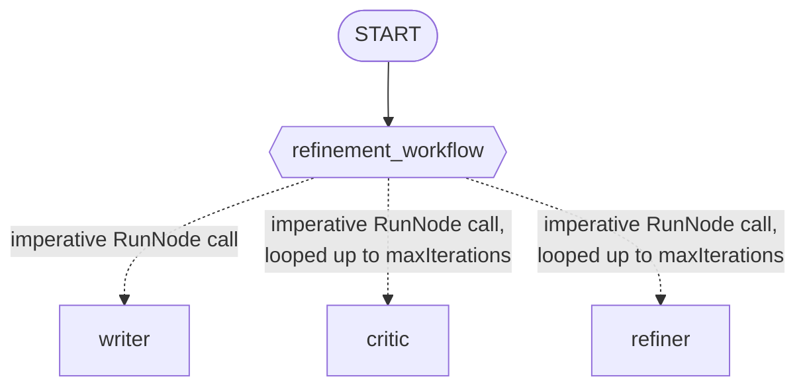

# Módulo 20: Workflows Cíclicos — Iteración y Autocorrección (Go) 🔁

## Teoría

### Iterar es simplemente... un loop 😄

El módulo 18 nos dio `workflow.NewDynamicNode` y `workflow.RunNode` para orquestación imperativa y guiada por código — el cuerpo de un nodo dinámico es código Go normal, libre de llamar a otros nodos en el orden que quiera. Buenas noticias: iterar no necesita nada nuevo encima de eso. Un `for` dentro del mismo tipo de función, llamando a `RunNode` una y otra vez, es *todo* el mecanismo. No hay que aprender ningún constructo especial de "Loop" — ya sabes hacer esto. 🎉

```go
refinementWorkflow := workflow.NewDynamicNode("refinement_workflow",
    func(ctx agent.Context, topic string, emit func(*session.Event) error) (string, error) {
        currentStory, err := workflow.RunNode[string](ctx, writerNode, fmt.Sprintf("Topic: %s", topic))
        if err != nil {
            return "", err
        }

        for i := 0; i < maxIterations; i++ {
            feedback, err := workflow.RunNode[string](ctx, criticNode, currentStory)
            if err != nil {
                return "", err
            }
            if strings.Contains(feedback, "APPROVED") {
                break
            }

            currentStory, err = workflow.RunNode[string](ctx, refinerNode,
                fmt.Sprintf("WORK:\n%s\n\nFEEDBACK:\n%s", currentStory, feedback))
            if err != nil {
                return "", err
            }
        }

        return currentStory, nil
    },
    workflow.NodeConfig{},
)
```

Todo lo que un loop necesita — un tope duro de iteraciones, una condición de salida anticipada, manejo de errores con el clásico `if err != nil` — es puro Go. Nada que configurar en un framework.

### Ponle un límite de seguridad 🛑

`const maxIterations = 3` — una condición de salida decidida por el modelo (el juicio del crítico) necesita un tope duro, porque nada garantiza que el crítico llegue a decir "APPROVED" alguna vez. Confirmado en vivo: nuestra propia corrida convergió en solo 2 iteraciones, muy por debajo del límite — pero ese límite existe justo para las corridas que no convergerían solas.

### 🔍 Un detalle realmente importante: dónde vive de verdad la respuesta del loop

El `return currentStory, nil` del loop se convierte en el output del propio nodo dinámico — pero no aparece como una respuesta de chat normal. Lo confirmamos en vivo inspeccionando cada evento de una corrida real: los turnos del writer, el critic y el refiner generan eventos normales de contenido de chat (`Author: "writer"`/`"critic"`/`"refiner"`, `Content` real, `Output: nil`). El valor de retorno *real* del loop llega en un evento totalmente distinto — uno con `Author` igual al nombre del propio workflow agent raíz (`"EssayRefiner"`, el `workflowagent.Config.Name` de este paquete), con `Content: nil` y `Output` con la historia final.

Esto importa en la práctica: en nuestra corrida real de prueba, el *último* evento con contenido de chat fue la respuesta final del crítico, `"APPROVED"` — ¡no la historia! Si tu código necesita el resultado final limpio (un test, una llamada programática), lee `Output` del evento cuyo autor sea el nombre de tu workflow. No asumas que "lo último que se imprimió" es tu respuesta.

### Cómo se ve esto en la consola 💻

Lo confirmamos leyendo `cmd/launcher/console/console.go` directamente: el launcher de consola imprime el texto de cada evento con contenido de chat a medida que llega, y solo recurre a mostrar el `Output` de un evento sin contenido cuando *nunca* se imprimió nada como texto de chat. Como este loop siempre produce contenido de chat real (el borrador, cada veredicto, cada reescritura), ese fallback nunca se activa — el ensayo final pulido está ahí, visible más arriba en el mismo stream, solo que no está marcado especialmente como "la respuesta". Una sesión de consola te muestra de verdad toda la iteración desarrollándose en vivo, que es justo el punto de esta lección — solo no esperes que la última línea sea tu premio. 😉

### La forma del grafo



Un solo edge real — el loop en sí vive completamente dentro del cuerpo de la función `refinement_workflow`, la misma convención de flechas punteadas que usó el módulo 18 y por la misma razón. Dato curioso: esta es también la primera vez en el curso que `RunNode` llama al *mismo* nodo repetidamente dentro de un cuerpo de nodo dinámico, en vez de enrutar a un nodo distinto cada vez (el módulo 18 solo llamaba a cada nodo una vez). Confirmamos leyendo el scheduler directamente que las llamadas repetidas al mismo nodo hijo se manejan bien, cada una con su propio id de ejecución autoincremental — cero riesgo de colisión. 👍

### ¿Qué pasa si el crítico nunca aprueba? 🤷

Si el loop llega a `maxIterations` sin que el crítico haya dicho nunca "APPROVED", simplemente sale y devuelve la última reescritura del refiner — sin error separado, sin flag que distinga "aprobado" de "se rindió al llegar al límite". Es una simplificación deliberada para este laboratorio, no un descuido — si necesitas distinguir esos dos casos, devuelve un valor de estado extra junto con la historia.

### Puntos clave ✅
- Iterar no necesita ningún constructo nuevo del SDK: un `for`/`while` normal de Go dentro del cuerpo de un `workflow.NewDynamicNode`, llamando a `workflow.RunNode` repetidamente, es todo el mecanismo.
- Siempre ponle un límite de seguridad con nombre a un loop guiado por el modelo — nada garantiza que la condición de salida se dispare sola.
- El valor real de retorno del loop vive en el evento terminal cuyo autor es el nombre del workflow agent raíz, con `Output` establecido y `Content` en nil — no en el evento de chat que resulte quedar de último.
- El launcher de consola muestra en vivo cada turno intermedio de chat; solo recurre a mostrar el `Output` de un evento sin contenido cuando nunca se transmitió nada como texto, algo que simplemente no pasa con un loop como este.

<hr/>

> **¿Vienes de Python?** 🐍 El `for i in range(5): ... await ctx.run_node(...)` de Python dentro de una función `@node(rerun_on_resume=True)` se traduce directamente al `for i := 0; i < maxIterations; i++ { ... workflow.RunNode(...) }` de Go dentro de un `workflow.NewDynamicNode` — el mismo mecanismo que ya te dio el módulo 18, con el equivalente de `rerun_on_resume` ya configurado automáticamente para los nodos `LlmAgent` (confirmado en el módulo 19). El laboratorio de Python advierte que el segundo argumento de `ctx.run_node()` es posicional, no un keyword; el `RunNode` de Go no tiene mecanismo de keyword-arguments en absoluto, así que esa advertencia en particular simplemente no aplica aquí.
