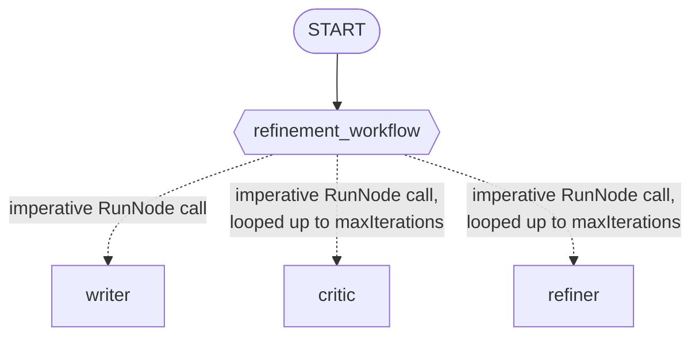

# Module 20: Cyclic Workflows — Iteration and Self-Correction (Go) 🔁

## Theory

### Iteration Is Just... a Loop 😄

Module-18 gave us `workflow.NewDynamicNode` and `workflow.RunNode` for imperative, code-driven orchestration — a dynamic node's body is plain Go code, free to call other nodes in whatever order it wants. Good news: iteration doesn't need anything new on top of that. A `for` loop inside the same kind of function body, calling `RunNode` again and again, is the *whole* mechanism. No separate "Loop" construct to learn — you already know this part. 🎉

```go
refinementWorkflow := workflow.NewDynamicNode("refinement_workflow",
    func(ctx agent.Context, topic string, emit func(*session.Event) error) (string, error) {
        currentStory, err := workflow.RunNode[string](ctx, writerNode, fmt.Sprintf("Topic: %s", topic))
        if err != nil {
            return "", err
        }

        for i := 0; i < maxIterations; i++ {
            feedback, err := workflow.RunNode[string](ctx, criticNode, currentStory)
            if err != nil {
                return "", err
            }
            if strings.Contains(feedback, "APPROVED") {
                break
            }

            currentStory, err = workflow.RunNode[string](ctx, refinerNode,
                fmt.Sprintf("WORK:\n%s\n\nFEEDBACK:\n%s", currentStory, feedback))
            if err != nil {
                return "", err
            }
        }

        return currentStory, nil
    },
    workflow.NodeConfig{},
)
```

Everything a loop needs — a hard iteration cap, an early-exit condition, plain old `if err != nil` error handling — is just Go. Nothing to configure in a framework.

### Give It a Safety Cap 🛑

`const maxIterations = 3` — a model-driven exit condition (the critic's own judgment call) needs a hard backstop, because nothing guarantees the critic ever actually says "APPROVED." Confirmed live: our own test run converged in just 2 iterations, comfortably under the cap — but that cap is there for the runs that *wouldn't* converge on their own.

### 🔍 A Genuinely Important Gotcha: Where the Loop's Real Answer Actually Lives

The loop's `return currentStory, nil` becomes the dynamic node's own output — but it doesn't show up the way a normal chat response does. We confirmed this live by inspecting every single event in a real run: the writer, critic, and refiner's own turns each fire off ordinary chat-content events (`Author: "writer"`/`"critic"`/`"refiner"`, real `Content`, `Output: nil`). The loop's *actual* return value shows up on a totally different event — one authored by the root workflow agent's own name (`"EssayRefiner"`, this package's `workflowagent.Config.Name`), with `Content: nil` and `Output` set to the final story.

Here's why that matters in practice: in our real test run, the *last* chat-content event was the critic's own final `"APPROVED"` reply — not the story! If your code wants the clean final result (a test, a programmatic caller), read `Output` from the event authored by the workflow's own name. Don't assume "whatever text came last" is your answer.

### How This Looks in the Console 💻

We confirmed this by reading `cmd/launcher/console/console.go` directly: the console launcher prints every chat-content event's text as it streams in, and only falls back to rendering a content-less event's `Output` when nothing was *ever* printed as chat text. Since this loop always produces real chat content (the draft, every verdict, every rewrite), that fallback never kicks in — the polished final essay is sitting right there in the stream, just not specially flagged as "the answer." A console session genuinely shows you the whole iteration unfolding live, which is the entire point of this lesson — just don't expect the last line to be your prize. 😉

### The Graph's Shape



One real edge — the loop itself lives entirely inside `refinement_workflow`'s own function body, same dashed-arrow convention module-18 used and for the same reason. Fun fact: this is also this course's first time `RunNode` calls the *same* node repeatedly within one dynamic node's body, instead of routing to a different node each time (module-18 only ever called each node once). We confirmed by reading the scheduler directly that repeated calls to the same child node are handled correctly, each with its own auto-incrementing run id — zero collision risk. 👍

### What If the Critic Never Approves? 🤷

If the loop hits `maxIterations` without the critic ever saying "APPROVED," it just exits and returns whatever the refiner's last rewrite was — no separate error, no flag distinguishing "approved" from "gave up at the cap." That's a deliberate simplification for this lab, not an oversight — if you need to tell those two cases apart, return an extra status value alongside the story.

### Key Takeaways ✅
- Iteration needs zero new SDK constructs: a plain Go `for`/`while` loop inside a `workflow.NewDynamicNode`'s body, calling `workflow.RunNode` repeatedly, is the whole mechanism.
- Always cap a model-driven loop with a named safety constant — nothing guarantees the exit condition fires on its own.
- The loop's real return value lives on the terminal event authored by the root workflow agent's own name, with `Output` set and `Content` nil — not on whatever chat-content event happens to land last.
- The console launcher streams every intermediate chat turn live; it only falls back to rendering a content-less event's `Output` when nothing was ever streamed as text, which just doesn't happen for a loop like this one.

<hr/>

> **Coming from Python?** 🐍 Python's `for i in range(5): ... await ctx.run_node(...)` inside an `@node(rerun_on_resume=True)` function maps directly onto Go's `for i := 0; i < maxIterations; i++ { ... workflow.RunNode(...) }` inside a `workflow.NewDynamicNode` — same mechanism module-18 already gave you, with `rerun_on_resume`'s Go equivalent already set automatically for `LlmAgent` nodes (confirmed in module-19). Python's lab notes `ctx.run_node()`'s second argument is positional, not a keyword; Go's `RunNode` has no keyword-argument mechanism at all, so that specific caution just doesn't apply here.
