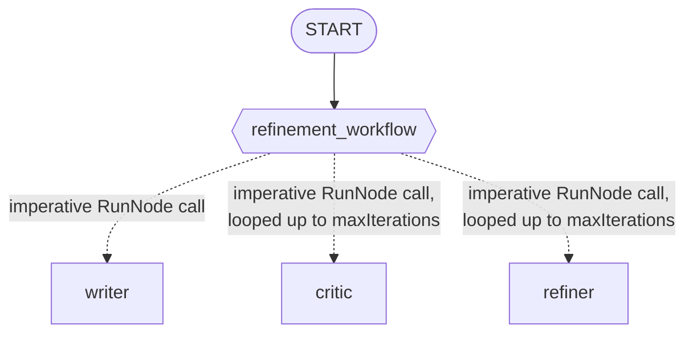

# Laboratorio 20: Construyendo un Sistema de Refinamiento de Ensayos (Go) ✍️

## Objetivo

¡Vamos a construir un sistema que se mejora a sí mismo! Un writer redacta algo, y luego un loop de critic/refiner lo va puliendo — con un tope de 3 iteraciones — hasta que el crítico da su aprobación. ✅

### La Arquitectura



### Paso 1: Los Tres Agentes 🧑‍🤝‍🧑

```go
writer, _ := llmagent.New(llmagent.Config{
    Name:        "writer",
    Instruction: writerInstruction, // "Write a short story (2-3 sentences)..."
})
critic, _ := llmagent.New(llmagent.Config{
    Name:        "critic",
    Instruction: criticInstruction, // "...reply with exactly APPROVED once satisfied"
})
refiner, _ := llmagent.New(llmagent.Config{
    Name:        "refiner",
    Instruction: refinerInstruction, // "Rewrite the story to address the feedback..."
})
```

Instrucciones en lenguaje simple, sin placeholders de plantilla `{key}` — el input de un `RunNode` de un nodo se convierte directo en el contenido de ese turno; no llena plantillas de instrucciones (esas solo se resuelven desde el estado de la sesión).

### Paso 2: El Orquestador Iterativo 🔄

```go
const maxIterations = 3

refinementWorkflow := workflow.NewDynamicNode("refinement_workflow",
    func(ctx agent.Context, topic string, emit func(*session.Event) error) (string, error) {
        currentStory, err := workflow.RunNode[string](ctx, writerNode, fmt.Sprintf("Topic: %s", topic))
        if err != nil {
            return "", err
        }

        for i := 0; i < maxIterations; i++ {
            feedback, err := workflow.RunNode[string](ctx, criticNode, currentStory)
            if err != nil {
                return "", err
            }
            if strings.Contains(feedback, "APPROVED") {
                break
            }

            currentStory, err = workflow.RunNode[string](ctx, refinerNode,
                fmt.Sprintf("WORK:\n%s\n\nFEEDBACK:\n%s", currentStory, feedback))
            if err != nil {
                return "", err
            }
        }

        return currentStory, nil
    },
    workflow.NodeConfig{},
)
```

Aquí no hay ninguna magia de framework — solo una llamada inicial a `RunNode`, y después un `for` normal de Go con un `break` anticipado. Eso es todo. 🙂

### Paso 3: Arma el Grafo 🧩

```go
edges := []workflow.Edge{
    {From: workflow.Start, To: refinementWorkflow},
}

rootAgent, _ := workflowagent.New(workflowagent.Config{Name: "EssayRefiner", Edges: edges})
```

Un solo edge — todo el loop de refinamiento vive dentro del propio cuerpo de `refinement_workflow`.

### Paso 4: Corre y Míralo en Vivo 🚀

```bash
go run ./cmd/essay-refiner console
```

Salida real y confirmada de este comando exacto (backend Gemini, un solo stream continuo — la consola imprime el texto de cada turno a medida que ocurre):

```
User -> a stray cat exploring an abandoned subway station
Agent -> With velvet paws, the ginger cat slipped through the rusted turnstiles and
descended into the cool, silent depths of the forgotten subway station. He stalked along
the edge of the dark tracks, his golden eyes tracking the dance of dust motes in a shaft
of moonlight piercing the street grate above. Finding a torn velvet seat inside a decaying
train car, he curled into a tight ball, his soft purrs claiming the quiet subterranean
kingdom as his own.Please find a way to incorporate the word "treasure" into this
beautifully atmospheric scene.With velvet paws, the ginger cat slipped through the rusted
turnstiles and descended into the cool, silent depths of the forgotten subway station. He
stalked along the edge of the dark tracks, his golden eyes tracking the dance of dust
motes in a shaft of moonlight piercing the street grate above. Finding a torn velvet
seat—a forgotten treasure inside a decaying train car—he curled into a tight ball, his
soft purrs claiming the quiet subterranean kingdom as his own.APPROVED
```

Fíjate que toda la iteración pasa justo frente a ti: el borrador, la retroalimentación del crítico (pidiendo la palabra "treasure"), la historia refinada que la incorpora, y el "APPROVED" final del crítico — todo impreso uno tras otro, porque la consola transmite cada turno real de chat a medida que ocurre. Lo último que se imprime es "APPROVED", no la historia — el ensayo pulido está ahí, visible más arriba en el mismo stream. 👀

### Paso 5: Un Test Real y Confirmado 🧪

El test en vivo de `agent_test.go` ni se molesta en buscar la respuesta en el stream visible de chat — lee directamente el evento terminal del propio nodo dinámico:

```go
for event, runErr := range r.Run(ctx, userID, sessionID, msg, agent.RunConfig{}) {
    if event.Author == "EssayRefiner" {
        s, ok := event.Output.(string)
        if !ok {
            t.Fatalf("workflow terminal event.Output type = %T, want string", event.Output)
        }
        finalStory = s
    }
}
```

Esta es la única señal confiable para el valor real de retorno del loop — confirmado en vivo: todos los demás eventos del stream (el borrador del writer, los veredictos del critic, las reescrituras del refiner) tienen `Content` real y `Output: nil`; solo el evento terminal del workflow tiene `Content: nil` y `Output` con la historia final.

El test después verifica que la historia final contenga literalmente la palabra "treasure" — justo lo que el crítico exige antes de aprobar, y algo que el borrador inicial no tiene ninguna razón para incluir por su cuenta. Eso prueba que el loop de critic/refiner realmente corrió y realmente incorporó la retroalimentación — no solo que volvió alguna historia. 💪

### Solución de Problemas

¿Algo no funcionó como esperabas? Revisa [troubleshooting.md](./troubleshooting.md).

### Resumen del Laboratorio 🎉

Construiste un workflow cíclico real: un `for` normal de Go dentro del cuerpo de un nodo dinámico, llamando a `workflow.RunNode` repetidamente con una condición de salida anticipada y un límite duro de seguridad — probado en vivo, con un test que lee el valor real de retorno del loop desde el único evento que realmente lo tiene. ¡Buen trabajo!

### Preguntas de Autorreflexión 🤔
- ¿Por qué el test verifica `event.Author == "EssayRefiner"` en vez de simplemente tomar el último pedazo de texto de chat visible? ¿Qué habría salido mal con el enfoque ingenuo — y de verdad pasó durante las pruebas de este laboratorio?
- ¿Qué pasaría si la instrucción del crítico nunca produjera el string literal "APPROVED"? ¿El loop daría error, o haría otra cosa? ¿Qué controla eso?
- ¿Cómo modificarías este loop para guardar *cada* borrador intermedio, no solo el final? ¿Dónde los guardarías?

<hr/>

> **¿Vienes de Python?** 🐍 El `for i in range(5): ... await ctx.run_node(...)` de Python dentro de una función `@node(rerun_on_resume=True)` se traduce directo al `for` propio de Go en este laboratorio, llamando a `workflow.RunNode` dentro de un `workflow.NewDynamicNode` — el mismo mecanismo que ya armó el módulo 18, con el equivalente de `rerun_on_resume` ya manejado automáticamente. El laboratorio de Python advierte que el segundo argumento de `ctx.run_node()` es posicional, no un keyword; el `RunNode` de Go no tiene argumentos de keyword en absoluto, así que esa advertencia no aplica aquí.
