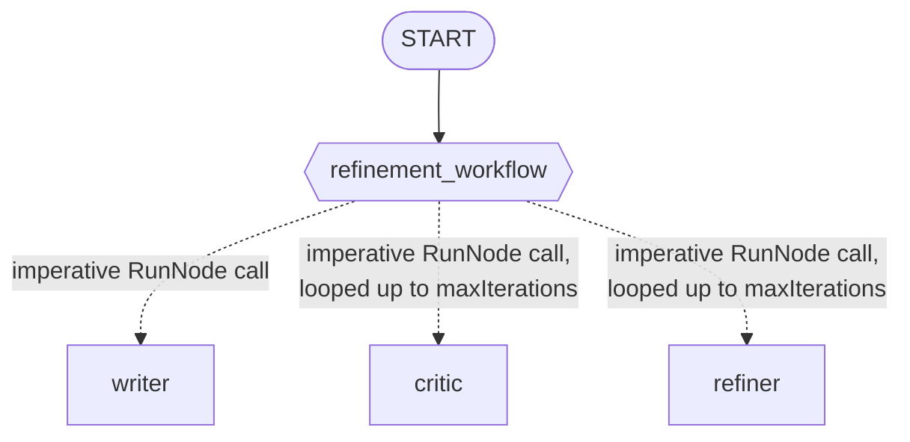

# Lab 20: Building an Essay Refinement System (Go)

## Goal

Build a self-improving system: a writer produces a draft, then a critic/refiner loop iterates on it — capped at 3 iterations — until the critic approves.

### The Architecture



### Step 1: The Three Agents

```go
writer, _ := llmagent.New(llmagent.Config{
    Name:        "writer",
    Instruction: writerInstruction, // "Write a short story (2-3 sentences)..."
})
critic, _ := llmagent.New(llmagent.Config{
    Name:        "critic",
    Instruction: criticInstruction, // "...reply with exactly APPROVED once satisfied"
})
refiner, _ := llmagent.New(llmagent.Config{
    Name:        "refiner",
    Instruction: refinerInstruction, // "Rewrite the story to address the feedback..."
})
```

Plain-language instructions, no `{key}` template placeholders — a node's `RunNode` input becomes that turn's content directly, it doesn't populate instruction templates (those only resolve from session state).

### Step 2: The Iterative Orchestrator

```go
const maxIterations = 3

refinementWorkflow := workflow.NewDynamicNode("refinement_workflow",
    func(ctx agent.Context, topic string, emit func(*session.Event) error) (string, error) {
        currentStory, err := workflow.RunNode[string](ctx, writerNode, fmt.Sprintf("Topic: %s", topic))
        if err != nil {
            return "", err
        }

        for i := 0; i < maxIterations; i++ {
            feedback, err := workflow.RunNode[string](ctx, criticNode, currentStory)
            if err != nil {
                return "", err
            }
            if strings.Contains(feedback, "APPROVED") {
                break
            }

            currentStory, err = workflow.RunNode[string](ctx, refinerNode,
                fmt.Sprintf("WORK:\n%s\n\nFEEDBACK:\n%s", currentStory, feedback))
            if err != nil {
                return "", err
            }
        }

        return currentStory, nil
    },
    workflow.NodeConfig{},
)
```

Nothing here is a framework feature — it's an initial `RunNode` call, then an ordinary Go `for` loop with an early `break`.

### Step 3: Assemble the Graph

```go
edges := []workflow.Edge{
    {From: workflow.Start, To: refinementWorkflow},
}

rootAgent, _ := workflowagent.New(workflowagent.Config{Name: "EssayRefiner", Edges: edges})
```

One edge — the whole refinement loop lives inside `refinement_workflow`'s own body.

### Step 4: Run and Verify

```bash
go run ./cmd/essay-refiner console
```

Real, confirmed output from this exact command (Gemini backend, one continuous stream — the console prints every turn's text as it happens):

```
User -> a stray cat exploring an abandoned subway station
Agent -> With velvet paws, the ginger cat slipped through the rusted turnstiles and
descended into the cool, silent depths of the forgotten subway station. He stalked along
the edge of the dark tracks, his golden eyes tracking the dance of dust motes in a shaft
of moonlight piercing the street grate above. Finding a torn velvet seat inside a decaying
train car, he curled into a tight ball, his soft purrs claiming the quiet subterranean
kingdom as his own.Please find a way to incorporate the word "treasure" into this
beautifully atmospheric scene.With velvet paws, the ginger cat slipped through the rusted
turnstiles and descended into the cool, silent depths of the forgotten subway station. He
stalked along the edge of the dark tracks, his golden eyes tracking the dance of dust
motes in a shaft of moonlight piercing the street grate above. Finding a torn velvet
seat—a forgotten treasure inside a decaying train car—he curled into a tight ball, his
soft purrs claiming the quiet subterranean kingdom as his own.APPROVED
```

Notice the whole iteration is visible: the draft, the critic's feedback (asking for the word "treasure"), the refined story that incorporates it, and the critic's final "APPROVED" — all printed back to back, since the console streams every real chat turn as it happens. The very last thing printed is "APPROVED," not the story — the polished essay is visible earlier in the same stream.

### Step 5: A Real, Confirmed Test

`agent_test.go`'s live test doesn't look for the answer in the visible chat stream at all — it reads the dynamic node's own terminal event directly:

```go
for event, runErr := range r.Run(ctx, userID, sessionID, msg, agent.RunConfig{}) {
    if event.Author == "EssayRefiner" {
        s, ok := event.Output.(string)
        if !ok {
            t.Fatalf("workflow terminal event.Output type = %T, want string", event.Output)
        }
        finalStory = s
    }
}
```

This is the one reliable signal for the loop's real return value, confirmed live: every other event in the stream (the writer's draft, the critic's verdicts, the refiner's rewrites) has real `Content` and `Output: nil`; only the workflow's own terminal event has `Content: nil` and `Output` set to the final story.

The test then checks the final story literally contains the word "treasure" — the exact thing the critic requires before approving, which the initial draft has no reason to include on its own. This proves the critic/refiner loop genuinely ran and genuinely incorporated the feedback, not just that some story came back.

### Troubleshooting

See [troubleshooting.md](./troubleshooting.md) if a step doesn't behave as expected.

### Lab Summary

You built a real cyclic workflow: a plain Go `for` loop inside a dynamic node's body, calling `workflow.RunNode` repeatedly with an early-exit condition and a hard safety cap — proven live, with a test that reads the loop's actual return value from the one event that actually carries it.

### Self-Reflection Questions
- Why does the test check `event.Author == "EssayRefiner"` instead of just capturing the last piece of visible chat text? What would have gone wrong with the naive approach, and did it actually happen during this lab's own testing?
- What would happen if the critic's own instruction never produced the literal string "APPROVED" — would the loop error out, or would it do something else? What controls that?
- How would you modify this loop to keep every intermediate draft, not just the final one? Where would you store them?

<hr/>

> **Coming from Python?** Python's `for i in range(5): ... await ctx.run_node(...)` inside an `@node(rerun_on_resume=True)` function maps directly onto this lab's own Go `for` loop calling `workflow.RunNode` inside a `workflow.NewDynamicNode` — the exact mechanism module-18 already established, `rerun_on_resume`'s Go equivalent already handled automatically. Python's lab notes `ctx.run_node()`'s second argument is positional, not a keyword; Go's `RunNode` has no keyword arguments at all, so that specific caution doesn't apply here.
