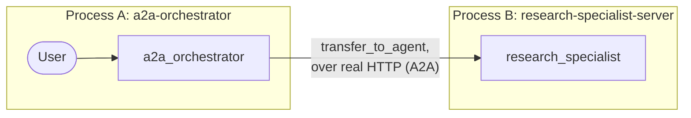

# Módulo 21: Grafos Distribuidos — A2A y Nodos Externos (Go) 🌐

## Teoría

### Un Grafo Que Abarca Varios Procesos 🏗️

Todos los sistemas multi-agente de los módulos anteriores corrieron dentro de un solo proceso — incluso el equipo colaborativo del módulo 19, con su delegación guiada por modo, seguía siendo puro código Go local llamando a otro código Go local. El protocolo Agent-to-Agent (A2A) tumba esa pared: un nodo de tu grafo puede ser un servicio realmente separado, corriendo en otra máquina, en otro lenguaje, gestionado por un equipo completamente distinto — y lo alcanzas exactamente de la misma forma que a cualquier otro sub-agente, con el mecanismo `SubAgents` que ya conoces.

### Exponer un Agente: el Launcher `a2a` 🚀

`google.golang.org/adk/v2/cmd/launcher/web/a2a` es un `web.Sublauncher` real, y encaja exactamente en la misma estructura `universal.NewLauncher` que usa cualquier otro programa `cmd/` de este curso:

```go
config := &launcher.Config{AgentLoader: agent.NewSingleLoader(specialist)}
l := universal.NewLauncher(web.NewLauncher(a2a.NewLauncher()))
l.Execute(ctx, config, os.Args[1:])
```

Ejecútalo con `web --port 8001 a2a -a2a_agent_url http://localhost:8001`. Esto no es ningún atajo casero — es justo lo que usan las propias configuraciones de launcher de producción del SDK (`cmd/launcher/prod`, `cmd/launcher/full`) para soporte A2A. Deriva la tarjeta del agente directamente del agente raíz — nombre, descripción, incluso skills auto-generadas a partir de la propia instrucción del agente — y sirve tanto el protocolo A2A actual (1.0) como el de compatibilidad heredada (0.3) al mismo tiempo, en `/a2a/v1/invoke` y `/a2a/invoke` respectivamente. Confirmado en vivo: un `curl` real contra la ruta bien conocida devuelve una tarjeta de agente genuina y completamente poblada, sin construcción manual alguna. 🎉

### La Tarjeta del Agente: La Misma Ruta Bien Conocida, Sin Importar el Lenguaje 🗺️

`a2asrv.WellKnownAgentCardPath` es literalmente `"/.well-known/agent-card.json"` — la misma ruta exacta que usa el `AGENT_CARD_WELL_KNOWN_PATH` de Python, y el launcher `a2a` la registra automáticamente.

### Conectando con un Agente Remoto: `agent/remoteagent/v2.NewA2A` 🔌

```go
remoteResearcher, err := remoteagentv2.NewA2A(remoteagentv2.A2AConfig{
    Name:              "research_specialist",
    AgentCardProvider: remoteagentv2.NewAgentCardProvider(specialistBaseURL),
})
```

`NewAgentCardProvider(baseURL)` obtiene la tarjeta desde `baseURL + WellKnownAgentCardPath` automáticamente — solo dale la dirección base del especialista, no la ruta bien conocida completa. El `remoteResearcher` que obtienes es un `agent.Agent` normal, registrado en el `SubAgents` de un coordinador exactamente igual que cualquier sub-agente local:

```go
coordinator, err := llmagent.New(llmagent.Config{
    Name:        "a2a_orchestrator",
    Instruction: coordinatorInstruction,
    SubAgents:   []agent.Agent{remoteResearcher},
})
```

### Probado en Vivo: Un Viaje de Ida y Vuelta por Red Genuino ✅

Confirmado con un `net.Listener` real en un puerto TCP de verdad — y para el laboratorio final, dos procesos de sistema operativo realmente separados en dos terminales. El modelo del coordinador llama a `transfer_to_agent` apuntando al nodo remoto exactamente como lo haría con un sub-agente local en `ModeChat`, y la solicitud sí cruza la red de verdad.

**⚠️ Una trampa real y confirmada que el propio test de este módulo encontró (y arregló):** que `event.Author` coincida con el nombre del propio agente remoto *no es*, por sí solo, prueba de que el viaje de ida y vuelta funcionó. Todos los caminos de fallo en `remoteagent/v2` — una tarjeta de agente que no se puede resolver, un RPC fallido, un timeout de red — igual sintetizan un evento de error marcado con ese mismo nombre del agente wrapper local. Un test (o cualquier código) que solo verifique `event.Author` pasaría exactamente igual sin importar si el especialista realmente respondió o si la conexión falló por completo. La prueba real está en el contenido: el test final verifica `event.ErrorMessage == ""` y que llegó texto de respuesta real y no vacío — y un test de camino negativo dedicado (apuntando a una dirección genuinamente inalcanzable) confirma que esa verificación sí falla cuando debe, algo que la versión que solo miraba el autor nunca habría podido detectar.

### Una Diferencia de Forma en la API Confirmada Respecto a Python

El `RemoteA2aAgent` de Python expone un campo `mode`, pero más limitado que el de un agente local — solo `"task"` o `None`. El `A2AConfig` de Go no tiene ningún campo `Mode`. En cambio, tiene `AllowTransferToAgent bool` — un asunto totalmente distinto: si se respeta localmente una intención de transferencia que el propio modelo del agente *remoto* establece, no un mecanismo de selección de modo. El valor por defecto de este módulo (`AllowTransferToAgent` sin definir) coincidió con el comportamiento por defecto `mode=None` de Python — un objetivo simple de `transfer_to_agent` — pero a través de una superficie de configuración estructuralmente distinta, no un campo renombrado equivalente.

### La Forma del Grafo



Dos cajas, dos invocaciones separadas de `go run`, una llamada de red real entre ellas. 🌐

### Puntos Clave ✅
- `cmd/launcher/web/a2a.NewLauncher()` es un `web.Sublauncher` real y de grado de producción para exponer cualquier agente como servicio A2A — se puede combinar con el mismo launcher estándar que usa cualquier otro programa `cmd/`, y deriva la tarjeta del agente automáticamente.
- La ruta bien conocida de la tarjeta del agente (`/.well-known/agent-card.json`) es idéntica en ambos lenguajes.
- `agent/remoteagent/v2.NewA2A` junto con `NewAgentCardProvider` es el proxy del lado cliente; el agente resultante se registra en `SubAgents` exactamente igual que uno local.
- `A2AConfig` no tiene campo `Mode` — la superficie de configuración de agentes remotos en Go es estructuralmente distinta al `mode` más limitado de Python, no un equivalente renombrado.
- `event.Author` por sí solo nunca prueba que una llamada remota tuvo éxito — ¡los eventos de error también llevan ese mismo autor! Verifica contenido real y sin errores en su lugar.

<hr/>

> **¿Vienes de Python?** 🐍 El `to_a2a(root_agent, port=8001)` de Python agrupa la construcción del servidor en una sola llamada; el `universal.NewLauncher(web.NewLauncher(a2a.NewLauncher()))` de este laboratorio es el equivalente directo en Go, ejecutado como `web --port 8001 a2a -a2a_agent_url ...` en vez de una sola función, pero compuesto con el mismo launcher estándar que ya usa cualquier otro módulo de este curso. `RemoteA2aAgent(agent_card=url, use_legacy=False)` se traduce a `remoteagentv2.NewA2A(A2AConfig{AgentCardProvider: NewAgentCardProvider(url)})` — Go no tiene un flag `use_legacy` en `remoteagent/v2` mismo; existe un paquete separado y más antiguo, `agent/remoteagent` (sin el sufijo `/v2`), cuyo propio comentario de documentación lo marca como obsoleto a favor de `/v2`, pero esta sesión no verificó si corresponde exactamente al conjunto específico de bugs del modo legacy de Python — este laboratorio simplemente usa `remoteagent/v2`, el paquete activamente mantenido, y no necesita que esa distinción importe.
