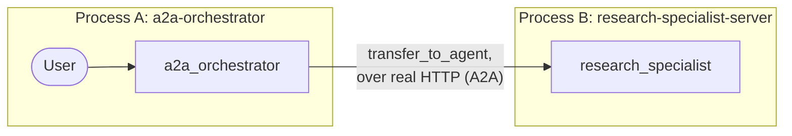

# Module 21: Distributed Graphs — A2A and External Nodes (Go) 🌐

## Theory

### A Graph That Spans Processes 🏗️

Every prior module's multi-agent system ran inside one process — even module-19's collaborative team, with its mode-driven delegation, was still all local Go code calling local Go code. The Agent-to-Agent (A2A) protocol tears down that wall: a node in your graph can be a genuinely separate service, running on a different machine, in a different language, managed by a completely different team — and you reach it the exact same way you reach any other sub-agent, through the `SubAgents` mechanism you already know.

### Exposing an Agent: the `a2a` Launcher 🚀

`google.golang.org/adk/v2/cmd/launcher/web/a2a` is a real `web.Sublauncher`, and it slots into the exact same `universal.NewLauncher` shape every other `cmd/` program in this course uses:

```go
config := &launcher.Config{AgentLoader: agent.NewSingleLoader(specialist)}
l := universal.NewLauncher(web.NewLauncher(a2a.NewLauncher()))
l.Execute(ctx, config, os.Args[1:])
```

Run it with `web --port 8001 a2a -a2a_agent_url http://localhost:8001`. This isn't some hand-rolled shortcut — it's what the SDK's own production launcher configurations (`cmd/launcher/prod`, `cmd/launcher/full`) actually compose in for A2A support. It derives the agent card straight from the root agent — name, description, even auto-generated skills pulled from the agent's own instruction — and serves both the current (1.0) and legacy-compat (0.3) A2A protocols side by side, at `/a2a/v1/invoke` and `/a2a/invoke` respectively. Confirmed live: a real `curl` against the well-known path hands back a genuine, fully-populated agent card with zero manual construction needed. 🎉

### The Agent Card: Same Well-Known Path, No Matter the Language 🗺️

`a2asrv.WellKnownAgentCardPath` is literally `"/.well-known/agent-card.json"` — the exact same path Python's `AGENT_CARD_WELL_KNOWN_PATH` uses, and the `a2a` launcher registers it automatically.

### Connecting to a Remote Agent: `agent/remoteagent/v2.NewA2A` 🔌

```go
remoteResearcher, err := remoteagentv2.NewA2A(remoteagentv2.A2AConfig{
    Name:              "research_specialist",
    AgentCardProvider: remoteagentv2.NewAgentCardProvider(specialistBaseURL),
})
```

`NewAgentCardProvider(baseURL)` fetches the card from `baseURL + WellKnownAgentCardPath` automatically — just hand it the specialist's base address, not the full well-known path. The `remoteResearcher` you get back is a plain `agent.Agent`, registered into a coordinator's `SubAgents` exactly like any local sub-agent:

```go
coordinator, err := llmagent.New(llmagent.Config{
    Name:        "a2a_orchestrator",
    Instruction: coordinatorInstruction,
    SubAgents:   []agent.Agent{remoteResearcher},
})
```

### Proven Live: A Genuine Network Round Trip ✅

Confirmed with a real `net.Listener` on an actual TCP port — and for the shipped lab, two genuinely separate OS processes in two terminals. The coordinator's model calls `transfer_to_agent` targeting the remote node exactly as it would a local `ModeChat` sub-agent, and the request really does cross the network.

**⚠️ A genuine, confirmed pitfall this module's own test hit (and fixed):** `event.Author` matching the remote agent's own name is *not*, by itself, proof the round trip succeeded. Every failure path in `remoteagent/v2` — an unresolvable agent card, a failed RPC, a network timeout — still synthesizes an error event stamped with that exact same local wrapper agent's name. A test (or any code) that only checks `event.Author` would pass identically whether the specialist genuinely answered or the connection failed outright. The real proof is content: the shipped test checks `event.ErrorMessage == ""` and that real, non-empty response text actually came back — and a dedicated negative-path test (pointing at a genuinely unreachable address) confirms that check actually fails when it should, which the author-only version never would have caught.

### A Confirmed API-Shape Difference From Python

Python's `RemoteA2aAgent` exposes a `mode` field, but narrower than a local agent's — only `"task"` or `None`. Go's `A2AConfig` has no `Mode` field at all. Instead it has `AllowTransferToAgent bool` — a totally different concern: whether a transfer intent the *remote* agent's own model sets gets honored locally, not a mode-selection mechanism. This module's own default (`AllowTransferToAgent` left unset) matched Python's `mode=None` default behavior — a plain `transfer_to_agent` target — but through a structurally different config surface, not a renamed equivalent field.

### The Graph's Shape



Two boxes, two separate `go run` invocations, one real network call between them. 🌐

### Key Takeaways ✅
- `cmd/launcher/web/a2a.NewLauncher()` is a real, production-grade `web.Sublauncher` for exposing any agent as an A2A service — composable into the same standard launcher every other `cmd/` program uses, deriving the agent card automatically.
- The well-known agent card path (`/.well-known/agent-card.json`) is identical in both languages.
- `agent/remoteagent/v2.NewA2A` with `NewAgentCardProvider` is the client-side proxy; the resulting agent registers into `SubAgents` exactly like a local one.
- `A2AConfig` has no `Mode` field — Go's remote-agent config surface is structurally different from Python's narrower `mode`, not a renamed equivalent.
- `event.Author` alone never proves a remote call succeeded — error events get stamped with that same author too! Check for error-free, non-empty content instead.

<hr/>

> **Coming from Python?** 🐍 Python's `to_a2a(root_agent, port=8001)` bundles server construction into one call; this lab's `universal.NewLauncher(web.NewLauncher(a2a.NewLauncher()))` is the direct Go equivalent, run as `web --port 8001 a2a -a2a_agent_url ...` rather than a single function call, but composed from the same standard launcher every other module in this course already uses. `RemoteA2aAgent(agent_card=url, use_legacy=False)` maps onto `remoteagentv2.NewA2A(A2AConfig{AgentCardProvider: NewAgentCardProvider(url)})` — Go has no `use_legacy` flag on `remoteagent/v2` itself; there's a separate, older `agent/remoteagent` package (without the `/v2` suffix) whose own doc comment marks it deprecated in favor of `/v2`, but this session didn't verify it maps precisely onto Python's specific legacy-mode bug set — this lab simply uses `remoteagent/v2`, the actively maintained package, and doesn't need the distinction to matter.
