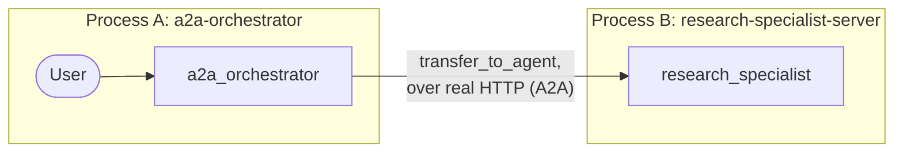

# Laboratorio 21: Construyendo un Sistema de Investigación Distribuido (Go) 🌍

## Objetivo

Vamos a construir un sistema multi-agente *realmente* distribuido: un servidor independiente `research_specialist` y un cliente separado `a2a_orchestrator` que le delega tareas por HTTP real, corriendo como dos procesos independientes en dos terminales — igualito al ejercicio de dos terminales de Python.

### La Arquitectura



### Paso 1: El Especialista (`internal/agents/researchspecialist`)

```go
func BuildRootAgent(llmModel model.LLM) (agent.Agent, error) {
    instruction, _ := prompts.Get(PromptNamespace + "/specialist_instruction")
    return llmagent.New(llmagent.Config{
        Name:        "research_specialist",
        Model:       llmModel,
        Instruction: instruction, // "Given a research topic, write a brief summary..."
    })
}
```

Es solo un `llmagent` normal — no tiene ni idea de que está a punto de exponerse a la red. Confirmado en vivo en este laboratorio: no hizo falta ninguna sección especial de instrucción tipo "ignora los mensajes internos de transición" para una solicitud de investigación directa como esta; el especialista respondió con coherencia y sin señales de confusión por contexto de orquestador. (El propio README de Python recomienda una sección así como buena práctica general para escenarios más complejos o de múltiples turnos — vale la pena tenerlo presente si extiendes este laboratorio.)

### Paso 2: El Servidor (`cmd/research-specialist-server`)

```go
config := &launcher.Config{AgentLoader: agent.NewSingleLoader(specialist)}
l := universal.NewLauncher(web.NewLauncher(a2a.NewLauncher()))
l.Execute(ctx, config, os.Args[1:])
```

Solo el launcher estándar, combinado con el propio sublauncher `a2a` del SDK — la misma estructura `universal.NewLauncher` que usa cualquier otro programa `cmd/` de este curso, no un servidor casero. ¡Muy consistente! 👍

### Paso 3: El Coordinador (`internal/agents/a2aorchestrator`)

```go
func BuildRootAgent(llmModel model.LLM, specialistBaseURL string) (agent.Agent, error) {
    instruction, _ := prompts.Get(PromptNamespace + "/coordinator_instruction")

    remoteResearcher, err := remoteagentv2.NewA2A(remoteagentv2.A2AConfig{
        Name:              "research_specialist",
        AgentCardProvider: remoteagentv2.NewAgentCardProvider(specialistBaseURL),
    })
    if err != nil {
        return nil, err
    }

    return llmagent.New(llmagent.Config{
        Name:        "a2a_orchestrator",
        Model:       llmModel,
        Instruction: instruction, // "Delegate any research request to research_specialist..."
        SubAgents:   []agent.Agent{remoteResearcher},
    })
}
```

`specialistBaseURL` viene de `RESEARCH_SPECIALIST_URL` (por defecto `http://localhost:8001`) en `cmd/a2a-orchestrator`, que mantiene el launcher estándar de console/web/api — desde su propia perspectiva, `research_specialist` es solo otra entrada más de `SubAgents`.

### Paso 4: Corre Ambos, En Dos Terminales Reales 🖥️🖥️

**Terminal 1 — el servidor del especialista:**

```bash
go run ./cmd/research-specialist-server web --port 8001 a2a -a2a_agent_url http://localhost:8001
```

```
🔬 research-specialist-server using gemini-3.5-flash
Web servers starts on http://localhost:8001
       a2a:  you can access A2A using jsonrpc protocol: http://localhost:8001
```

Confirma que de verdad es accesible antes de seguir — la tarjeta del agente se deriva automáticamente del propio agente, hasta con una skill auto-generada construida a partir de su propia instrucción:

```bash
curl -s http://localhost:8001/.well-known/agent-card.json
```
```json
{
  "name": "research_specialist",
  "description": "A remote research specialist reachable over A2A.",
  "version": "2.0.0",
  "skills": [{"id": "research_specialist", "name": "model", "description": "...", "tags": ["llm"]}],
  "supportedInterfaces": [
    {"url": "http://localhost:8001/a2a/v1/invoke", "protocolBinding": "JSONRPC", "protocolVersion": "1.0"},
    {"url": "http://localhost:8001/a2a/invoke", "protocolBinding": "JSONRPC", "protocolVersion": "0.3"}
  ]
}
```

**Terminal 2 — el cliente orquestador:**

```bash
go run ./cmd/a2a-orchestrator console
```

Salida real y confirmada de esta configuración exacta de dos terminales (backend Gemini):

```
🛰️  a2a-orchestrator using gemini-3.5-flash (specialist at http://localhost:8001)

User -> Please research the latest advancements in quantum computing.
Agent -> Recent advancements in quantum computing have marked a major shift toward fault
tolerance, highlighted by breakthroughs in error correction and the creation of
high-fidelity logical qubits by organizations like Harvard, QuEra, and Microsoft.
Concurrently, physical processors are scaling past the 1,000-qubit threshold, achieving
"quantum utility" where systems can simulate complex physical phenomena beyond the reach
of classical supercomputers. These dual achievements signify a rapid transition from the
noisy intermediate-scale quantum (NISQ) era toward practical, error-corrected quantum
systems.
```

Dos procesos separados de `go run`, una llamada de red real entre ellos. ¡Bastante genial! 🤩

### Paso 5: Un Test Real y Confirmado — y un Bug de Verdad Que Encontró en Sí Mismo 🐛

El test en vivo de `internal/agents/a2aorchestrator/agent_test.go` levanta un servidor HTTP genuino en un puerto asignado por el sistema operativo, exactamente igual que el `cmd/research-specialist-server` real:

```go
lis, _ := net.Listen("tcp", "127.0.0.1:0")
baseURL := "http://" + lis.Addr().String()
// ...wire up adka2a.NewExecutor + a2asrv handlers on lis, same primitives the a2a launcher uses...

rootAgent, _ := BuildRootAgent(llmModel, baseURL)
```

Aquí va una historia curiosa (bueno, humilde): una versión anterior de este test solo verificaba `event.Author == "research_specialist"` — y una revisión independiente detectó que eso no prueba *nada*. Todos los caminos de fallo en `remoteagent/v2` (una tarjeta de agente que no se puede resolver, un RPC fallido) sintetizan su *propio* evento de error marcado con ese mismo autor exacto. ¡El test habría pasado incluso si el especialista fuera completamente inalcanzable! 😅 La solución verifica el resultado real en su lugar:

```go
if event.Author != "research_specialist" {
    continue
}
if event.ErrorMessage != "" {
    t.Fatalf("research_specialist event carries an error, not a real response: %s", event.ErrorMessage)
}
// ...accumulate event.Content's real text...
```

Un test complementario, `TestA2AOrchestrator_UnreachableSpecialist_Gemini`, apunta el orquestador a una dirección donde nadie está escuchando y confirma que el evento resultante *sí* lleva un error — probando que la verificación corregida de verdad distingue el éxito del fallo, algo que la versión original que solo miraba el autor simplemente no podía hacer.

### Solución de Problemas

Revisa [troubleshooting.md](./troubleshooting.md) si algún paso no se comporta como esperabas.

### Resumen del Laboratorio 🎉

Construiste un sistema multi-agente realmente distribuido: un servicio HTTP A2A real usando el launcher estándar de este curso combinado con el sublauncher `a2a` del SDK, un nodo proxy que lo alcanza (`remoteagent/v2.NewA2A`), y un test que levanta un servidor de red real y verifica contenido genuino y sin errores — no solo un autor de evento que resultó no probar nada por sí solo. ¡Buen trabajo! 💪

### Preguntas de Autorreflexión 🤔
- ¿Cuáles son los principales beneficios de correr `research_specialist` como un servicio separado en vez de un sub-agente local — y qué te costó llegar ahí (archivos extra, un proceso extra, una URL que configurar)?
- ¿Por qué `event.Author == "research_specialist"` no es suficiente, por sí solo, para probar que una llamada remota tuvo éxito? ¿Cuál sería el cambio más pequeño a un test que restauraría esa falsa confianza?
- ¿Cómo permite la tarjeta de agente en una URL bien conocida una arquitectura desacoplada? ¿Qué necesitaría el orquestador en su lugar si ese mecanismo de descubrimiento no existiera?

<hr/>

> **¿Vienes de Python?** 🐍 El `to_a2a(root_agent, port=8001)` de Python agrupa la construcción del servidor en una sola llamada; el `universal.NewLauncher(web.NewLauncher(a2a.NewLauncher()))` de este laboratorio es el equivalente directo, ejecutado como `web --port 8001 a2a -a2a_agent_url ...`. `RemoteA2aAgent(agent_card=url, use_legacy=False)` se traduce a `remoteagentv2.NewA2A(A2AConfig{AgentCardProvider: NewAgentCardProvider(url)})`; el propio paquete `remoteagent/v2` de este laboratorio no tiene un flag `use_legacy` que configurar, porque ya es la implementación activamente mantenida.
