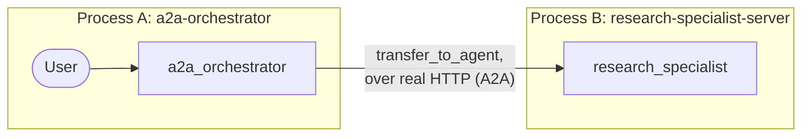

# Lab 21: Building a Distributed Research System (Go) 🌍

## Goal

Let's build a *genuinely* distributed multi-agent system: a standalone `research_specialist` server and a separate `a2a_orchestrator` client that delegates to it over real HTTP, running as two independent processes in two terminals — matching Python's own two-terminal exercise exactly.

### The Architecture



### Step 1: The Specialist (`internal/agents/researchspecialist`)

```go
func BuildRootAgent(llmModel model.LLM) (agent.Agent, error) {
    instruction, _ := prompts.Get(PromptNamespace + "/specialist_instruction")
    return llmagent.New(llmagent.Config{
        Name:        "research_specialist",
        Model:       llmModel,
        Instruction: instruction, // "Given a research topic, write a brief summary..."
    })
}
```

Just a plain `llmagent` — it has no idea it's about to be exposed over the network. Confirmed live this lab: no special "ignore internal transition messages" instruction section was needed for a straightforward research request like this one; the specialist answered coherently with zero signs of orchestrator-context confusion. (Python's own README recommends such a section as a general best practice for more complex or multi-turn scenarios — worth keeping in mind if you extend this lab.)

### Step 2: The Server (`cmd/research-specialist-server`)

```go
config := &launcher.Config{AgentLoader: agent.NewSingleLoader(specialist)}
l := universal.NewLauncher(web.NewLauncher(a2a.NewLauncher()))
l.Execute(ctx, config, os.Args[1:])
```

Just the standard launcher, composed with the SDK's own `a2a` sublauncher — the same `universal.NewLauncher` shape every other `cmd/` program in this course uses, not a hand-rolled server. Nice and consistent! 👍

### Step 3: The Coordinator (`internal/agents/a2aorchestrator`)

```go
func BuildRootAgent(llmModel model.LLM, specialistBaseURL string) (agent.Agent, error) {
    instruction, _ := prompts.Get(PromptNamespace + "/coordinator_instruction")

    remoteResearcher, err := remoteagentv2.NewA2A(remoteagentv2.A2AConfig{
        Name:              "research_specialist",
        AgentCardProvider: remoteagentv2.NewAgentCardProvider(specialistBaseURL),
    })
    if err != nil {
        return nil, err
    }

    return llmagent.New(llmagent.Config{
        Name:        "a2a_orchestrator",
        Model:       llmModel,
        Instruction: instruction, // "Delegate any research request to research_specialist..."
        SubAgents:   []agent.Agent{remoteResearcher},
    })
}
```

`specialistBaseURL` comes from `RESEARCH_SPECIALIST_URL` (default `http://localhost:8001`) in `cmd/a2a-orchestrator`, which keeps the standard console/web/api launcher — from its own point of view, `research_specialist` is just another `SubAgents` entry.

### Step 4: Run Both, In Two Real Terminals 🖥️🖥️

**Terminal 1 — the specialist server:**

```bash
go run ./cmd/research-specialist-server web --port 8001 a2a -a2a_agent_url http://localhost:8001
```

```
🔬 research-specialist-server using gemini-3.5-flash
Web servers starts on http://localhost:8001
       a2a:  you can access A2A using jsonrpc protocol: http://localhost:8001
```

Confirm it's genuinely reachable before moving on — the agent card is derived automatically from the agent itself, right down to an auto-generated skill built from its own instruction text:

```bash
curl -s http://localhost:8001/.well-known/agent-card.json
```
```json
{
  "name": "research_specialist",
  "description": "A remote research specialist reachable over A2A.",
  "version": "2.0.0",
  "skills": [{"id": "research_specialist", "name": "model", "description": "...", "tags": ["llm"]}],
  "supportedInterfaces": [
    {"url": "http://localhost:8001/a2a/v1/invoke", "protocolBinding": "JSONRPC", "protocolVersion": "1.0"},
    {"url": "http://localhost:8001/a2a/invoke", "protocolBinding": "JSONRPC", "protocolVersion": "0.3"}
  ]
}
```

**Terminal 2 — the orchestrator client:**

```bash
go run ./cmd/a2a-orchestrator console
```

Real, confirmed output from this exact two-terminal setup (Gemini backend):

```
🛰️  a2a-orchestrator using gemini-3.5-flash (specialist at http://localhost:8001)

User -> Please research the latest advancements in quantum computing.
Agent -> Recent advancements in quantum computing have marked a major shift toward fault
tolerance, highlighted by breakthroughs in error correction and the creation of
high-fidelity logical qubits by organizations like Harvard, QuEra, and Microsoft.
Concurrently, physical processors are scaling past the 1,000-qubit threshold, achieving
"quantum utility" where systems can simulate complex physical phenomena beyond the reach
of classical supercomputers. These dual achievements signify a rapid transition from the
noisy intermediate-scale quantum (NISQ) era toward practical, error-corrected quantum
systems.
```

Two separate `go run` processes, one real network call between them. Pretty cool, right? 🤩

### Step 5: A Real, Confirmed Test — and a Genuine Bug It Caught in Itself 🐛

`internal/agents/a2aorchestrator/agent_test.go`'s live test starts a genuine HTTP server on an OS-assigned port, exactly like the real `cmd/research-specialist-server`:

```go
lis, _ := net.Listen("tcp", "127.0.0.1:0")
baseURL := "http://" + lis.Addr().String()
// ...wire up adka2a.NewExecutor + a2asrv handlers on lis, same primitives the a2a launcher uses...

rootAgent, _ := BuildRootAgent(llmModel, baseURL)
```

Here's a fun (well, humbling) story: an earlier version of this test only checked `event.Author == "research_specialist"` — and independent review caught that this proves *nothing*. Every failure path in `remoteagent/v2` (an unresolvable agent card, a failed RPC) synthesizes its *own* error event stamped with that exact same author. The test would have passed even if the specialist were completely unreachable! 😅 The fix checks the actual outcome instead:

```go
if event.Author != "research_specialist" {
    continue
}
if event.ErrorMessage != "" {
    t.Fatalf("research_specialist event carries an error, not a real response: %s", event.ErrorMessage)
}
// ...accumulate event.Content's real text...
```

A companion test, `TestA2AOrchestrator_UnreachableSpecialist_Gemini`, points the orchestrator at an address nothing is listening on and confirms the resulting event *does* carry an error — proving the fixed assertion genuinely tells success from failure, something the original author-only version simply couldn't do.

### Troubleshooting

See [troubleshooting.md](./troubleshooting.md) if a step doesn't behave as expected.

### Lab Summary 🎉

You built a genuinely distributed multi-agent system: a real HTTP A2A service using this course's own standard launcher composed with the SDK's `a2a` sublauncher, a proxy node reaching it (`remoteagent/v2.NewA2A`), and a test that starts a real network server and checks for genuine, error-free content — not just an event author that turned out not to prove anything on its own. Solid work! 💪

### Self-Reflection Questions 🤔
- What are the main benefits of running `research_specialist` as a separate service instead of a local sub-agent — and what did it cost you to get there (extra files, an extra process, a URL to configure)?
- Why is `event.Author == "research_specialist"` not enough, by itself, to prove a remote call succeeded? What's the smallest change to a test that would restore that false confidence?
- How does the agent card at a well-known URL enable a decoupled architecture? What would the orchestrator need instead if that discovery mechanism didn't exist?

<hr/>

> **Coming from Python?** 🐍 Python's `to_a2a(root_agent, port=8001)` bundles server construction into one call; this lab's `universal.NewLauncher(web.NewLauncher(a2a.NewLauncher()))` is the direct equivalent, run as `web --port 8001 a2a -a2a_agent_url ...`. `RemoteA2aAgent(agent_card=url, use_legacy=False)` maps onto `remoteagentv2.NewA2A(A2AConfig{AgentCardProvider: NewAgentCardProvider(url)})`; this lab's own `remoteagent/v2` package has no `use_legacy` flag to set since it's already the actively maintained implementation.
